# FRIDAY Voice Assistant — Architectural Reference

> **Version:** 0.2 · **Date:** 2026-05-02 · **Status:** Production (v1 + v2 paths live)
>
> This document is the authoritative architectural reference for the FRIDAY voice assistant
> project located at `/home/tricky/Friday_Linux`. Every Python file in the project is described.
> All diagrams use Mermaid syntax and can be rendered by any Mermaid-aware renderer.

> **About v1 vs v2 (read this first).** Sections 1 – 30 below describe the original ("v1")
> architecture: `FridayApp` as the central hub, `CommandRouter`'s three-tier waterfall,
> `OrderedToolExecutor` running steps sequentially, and a single shared inference-lock pair.
> Sections 31 – 39 (added 2026-05-02) describe the **v2 layer** introduced by Phases 1 – 6 of
> the refactor in `docs/friday_architecture.md`: `TurnContext`, `MemoryService`,
> `IntentEngine` / `PlannerEngine` / `WorkflowCoordinator` / `TurnOrchestrator`,
> `TaskGraphExecutor`, separated inference locks, and `RuntimeKernel`. Both paths coexist
> in the codebase. Two `routing.*` config flags pick which path runs each turn — see §38
> for the full behavioural diff. Where a v1 statement below has been **superseded** by a
> v2 change, that statement is now annotated **`v1 only`** with a forward pointer to the
> relevant Phase section.

---

## Table of Contents

1. [Project Overview](#1-project-overview)
2. [Repository Layout](#2-repository-layout)
3. [System Bootstrap and Startup Sequence](#3-system-bootstrap-and-startup-sequence)
4. [FridayApp — The Central Hub](#4-fridayapp--the-central-hub)
5. [Configuration System](#5-configuration-system)
6. [Turn Pipeline — End-to-End Flow](#6-turn-pipeline--end-to-end-flow)
7. [Event Bus](#7-event-bus)
8. [Three-Tier Routing Architecture](#8-three-tier-routing-architecture)
9. [Intent Recognition](#9-intent-recognition)
10. [Capability Registry and Broker](#10-capability-registry-and-broker)
11. [Tool Execution Engine](#11-tool-execution-engine)
12. [LLM Stack — Models and Inference](#12-llm-stack--models-and-inference)
13. [Context and Conversation Management](#13-context-and-conversation-management)
14. [Memory Architecture](#14-memory-architecture)
15. [Persistence — SQLite and ChromaDB](#15-persistence--sqlite-and-chromadb)
16. [Speech Pipeline — STT](#16-speech-pipeline--stt)
17. [Speech Pipeline — TTS](#17-speech-pipeline--tts)
18. [Wake Word and Clap Detection](#18-wake-word-and-clap-detection)
19. [Speech Coordination](#19-speech-coordination)
20. [Extension and Plugin System](#20-extension-and-plugin-system)
21. [Workflow Orchestration](#21-workflow-orchestration)
22. [Reasoning — Route Scorer, Model Router, Graph Compiler](#22-reasoning--route-scorer-model-router-graph-compiler)
23. [Kernel Services — Consent and Permissions](#23-kernel-services--consent-and-permissions)
24. [Bootstrap Layer — Container, Lifecycle, Settings](#24-bootstrap-layer--container-lifecycle-settings)
25. [Tracing and Logging](#25-tracing-and-logging)
26. [Task Runner and Result Cache](#26-task-runner-and-result-cache)
27. [Module Catalogue](#27-module-catalogue)
28. [Skills Catalogue](#28-skills-catalogue)
29. [CLI and GUI Interfaces](#29-cli-and-gui-interfaces)
30. [Testing Architecture](#30-testing-architecture)

### v2 Layer (Phases 1 – 6, added 2026-05-02)
31. [v2 Architecture Overview](#31-v2-architecture-overview)
32. [Phase 1 — TurnContext + Workflow TTL](#32-phase-1--turncontext--workflow-ttl)
33. [Phase 2 — MemoryService Facade](#33-phase-2--memoryservice-facade)
34. [Phase 3 — Planning Layer (IntentEngine / PlannerEngine / WorkflowCoordinator / TurnOrchestrator)](#34-phase-3--planning-layer)
35. [Phase 4 — TaskGraphExecutor (Parallel Execution)](#35-phase-4--taskgraphexecutor-parallel-execution)
36. [Phase 5 — Inference Lock Separation](#36-phase-5--inference-lock-separation)
37. [Phase 6 — RuntimeKernel + ServiceContainer](#37-phase-6--runtimekernel--servicecontainer)
38. [Routing Configuration Flags — v1/v2 and ordered/parallel](#38-routing-configuration-flags)
39. [Migration Status, Tests, and What Was Corrected](#39-migration-status-tests-and-what-was-corrected)

---

## 1. Project Overview

FRIDAY is a locally-running AI voice assistant designed for Linux desktops. It combines
local LLM inference (llama-cpp-python), deterministic rule-based routing, a persistent
memory system, and a rich plugin/extension ecosystem. The design philosophy is:

- **Privacy first** — all LLM inference runs locally via GGUF quantised models.
- **Voice native** — every response is also spoken aloud via a piper TTS pipeline.
- **Modular** — capabilities are registered at runtime through a uniform CapabilityRegistry.
- **Transparent** — every request is traceable end-to-end through a contextvars-based trace ID.

### Key capabilities

| Domain | Examples |
|--------|---------|
| System control | Launch apps, volume, screenshot, battery/CPU/RAM |
| File operations | Search, open, read, summarise, create/update files |
| Browser automation | YouTube, YouTube Music, Google search via Playwright |
| Task management | Reminders, notes, calendar events (local + Google) |
| Research | DuckDuckGo + arXiv parallel search, LLM summarisation |
| Dictation | Memo capture to ~/Documents/friday-memos/ |
| Focus sessions | Pomodoro with GNOME notification muting |
| World news | WorldMonitor feed integration with 6 categories |
| Google Workspace | Gmail, Calendar, Drive via `gws` CLI |
| Memory | Episodic, semantic, and procedural three-tier memory |

---

## 2. Repository Layout

```
Friday_Linux/
├── main.py                     Entry point
├── config.yaml                 YAML configuration
├── core/                       Core framework
│   ├── app.py                  FridayApp central hub
│   ├── event_bus.py            Synchronous pub/sub bus
│   ├── router.py               CommandRouter (3-tier routing)
│   ├── intent_recognizer.py    Deterministic intent parsing
│   ├── turn_manager.py         Per-turn orchestration
│   ├── conversation_agent.py   Plan building and execution
│   ├── capability_broker.py    7-step capability selection
│   ├── capability_registry.py  Capability storage and dispatch
│   ├── context_store.py        SQLite + ChromaDB persistence
│   ├── model_manager.py        GGUF model loading
│   ├── assistant_context.py    Prompt construction
│   ├── workflow_orchestrator.py  Stateful multi-step workflows
│   ├── speech_coordinator.py   Per-turn speech deduplication
│   ├── response_finalizer.py   Humanise + clarification detection
│   ├── routing_state.py        RoutingDecision and RoutingState
│   ├── result_cache.py         TTL in-memory cache
│   ├── task_runner.py          Cancellable voice daemon threads
│   ├── tracing.py              contextvars trace IDs and JSONL export
│   ├── tool_execution.py       OrderedToolExecutor
│   ├── logger.py               RotatingFileHandler + trace filter
│   ├── config.py               ConfigManager (dot-notation YAML)
│   ├── plugin_manager.py       Legacy plugin loader
│   ├── skill.py                Skill ABC + SkillDescriptor
│   ├── delegation.py           DelegationManager + agent types
│   ├── dialog_state.py         PendingFileRequest/Clarification
│   ├── dialogue_manager.py     Domain ack templates + tone adapt
│   ├── memory_broker.py        Context bundle builder
│   ├── persona_manager.py      PersonaProfile + friday_core
│   ├── system_capabilities.py  System probe (26 modules, 18 bins)
│   ├── turn_feedback.py        Turn progress / ack helpers
│   ├── bootstrap/
│   │   ├── container.py        Singleton DI container
│   │   ├── lifecycle.py        Ordered service start/stop
│   │   └── settings.py         Frozen FridaySettings dataclasses
│   ├── extensions/
│   │   ├── protocol.py         Extension protocol + ExtensionContext
│   │   ├── loader.py           ExtensionLoader (3-tier adapter)
│   │   ├── adapter.py          LegacyExtensionAdapter
│   │   └── decorators.py       @capability decorator
│   ├── kernel/
│   │   ├── consent.py          ConsentService (online gating)
│   │   └── permissions.py      PermissionTier enum + infer_side_effect
│   ├── memory/
│   │   ├── episodic.py         EpisodicMemory (30-day turns window)
│   │   ├── semantic.py         SemanticMemory (facts + confidence)
│   │   ├── procedural.py       ProceduralMemory (Thompson sampling)
│   │   └── embeddings.py       HashEmbedder + BGESmallEmbedder
│   └── reasoning/
│       ├── graph_compiler.py   LangGraph StateGraph executor
│       ├── model_router.py     Qwen tool-selection with timeout
│       ├── route_scorer.py     Deterministic alias/pattern scoring
│       └── workflows/
│           ├── focus_mode.py   FocusModeWorkflow
│           └── research_mode.py  ResearchWorkflow
├── modules/
│   ├── voice_io/
│   │   ├── plugin.py           VoiceIOPlugin (TTS + voice mode)
│   │   ├── stt.py              STTEngine (faster-whisper, VAD)
│   │   ├── tts.py              TextToSpeech (piper + aplay/pw-cat)
│   │   ├── wake_detector.py    WakeWordDetector (openwakeword ONNX)
│   │   ├── clap_detector.py    Double-clap standalone process
│   │   ├── audio_devices.py    PipeWire/sounddevice device discovery
│   │   └── safety.py           VoiceSafetyLayer (media safety gate)
│   ├── system_control/
│   │   ├── plugin.py           20+ system capability registrations
│   │   ├── app_launcher.py     AppLaunchTarget + fuzzy matching
│   │   ├── file_search.py      search_files_raw + file utilities
│   │   ├── file_workspace.py   WorkspaceFileController
│   │   ├── file_readers.py     PDF/Markdown/text readers
│   │   ├── media_control.py    Volume control via wpctl/pactl
│   │   └── sys_info.py         psutil CPU/RAM/battery
│   ├── browser_automation/
│   │   ├── plugin.py           Browser capability registrations
│   │   └── service.py          BrowserMediaService (Playwright worker thread)
│   ├── task_manager/
│   │   └── plugin.py           Reminders/notes/calendar (SQLite)
│   ├── llm_chat/
│   │   └── plugin.py           LLMChatPlugin (Gemma 2B fallback)
│   ├── greeter/
│   │   ├── __init__.py         Legacy greeter stub
│   │   └── extension.py        GreeterExtension (greet + show_help)
│   ├── research_agent/
│   │   ├── plugin.py           ResearchAgentPlugin (background thread)
│   │   └── service.py          ResearchAgentService (DDG + arXiv)
│   ├── workspace_agent/
│   │   ├── extension.py        WorkspaceAgentExtension (Gmail/Calendar/Drive)
│   │   └── gws_client.py       gws CLI subprocess wrapper
│   ├── dictation/
│   │   ├── plugin.py           DictationPlugin (3 tools)
│   │   └── service.py          DictationService (session + memo files)
│   ├── focus_session/
│   │   └── plugin.py           FocusSessionPlugin (delegates to workflow)
│   ├── world_monitor/
│   │   ├── plugin.py           WorldMonitorPlugin (news tool)
│   │   └── service.py          WorldMonitorService (feed + API)
├── skills/                     Legacy Skill ABC implementations
│   ├── datetime_ops.py         DateTimeSkill
│   ├── weather_ops.py          WeatherSkill (OpenWeatherMap)
│   ├── memory_ops.py           MemorySkill (JSON file)
│   ├── system_ops.py           SystemSkill (macOS-targeted)
│   ├── web_ops.py              WebSkill (google_search via webbrowser)
│   ├── file_ops.py             FileSkill
│   ├── text_ops.py             TextSkill
│   ├── screenshot_ops.py       ScreenshotSkill
│   ├── clap_control_skill.py   ClapControlSkill (toggle_clap_trigger)
│   ├── camera_skill.py         CameraSkill (vision capture)
│   ├── detection_skill.py      DetectionSkill (object detection)
│   ├── vision_skill.py         VisionSkill (image analysis)
│   ├── gemini_live_skill.py    GeminiLiveSkill (live API)
│   ├── email_ops.py            EmailSkill
│   └── whatsapp_skill.py       WhatsAppSkill + whatsapp/ driver
├── cli/
│   └── terminal_ui.py          FridayTerminalUI (prompt_toolkit)
├── gui/
│   ├── main_window.py          MainWindow (PyQt5 legacy)
│   └── hud.py                  HUD (PyQt6 full-featured dashboard)
├── tests/                      pytest test suite
├── data/
│   ├── friday.db               SQLite database
│   └── chroma/                 ChromaDB vector store
├── logs/                       Rotating log files
└── models/                     GGUF model files
```

---

## 3. System Bootstrap and Startup Sequence

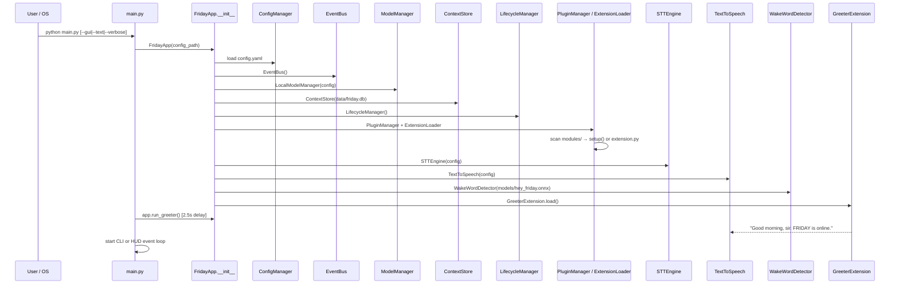

### main.py

**Path:** `/home/tricky/Friday_Linux/main.py`

The entry point. It:

1. Parses CLI arguments: `--text` (force text mode), `--gui` (force Qt HUD), `--verbose` (debug logging).
2. Constructs `FridayApp(config_path="config.yaml")`.
3. Installs `SIGINT`/`SIGTERM` signal handlers that call `app.shutdown()`.
4. After a 2.5-second startup delay, fires the greeter phrase via `app.run_greeter()`.
5. Launches either `FridayTerminalUI` (default, prompt_toolkit) or the Qt `HUD` depending on mode.

---

## 4. FridayApp — The Central Hub

**Path:** `/home/tricky/Friday_Linux/core/app.py`

`FridayApp` is the single object that manually wires every service. There is no runtime
dependency injection framework — every attribute is set in `__init__` in explicit wiring order.

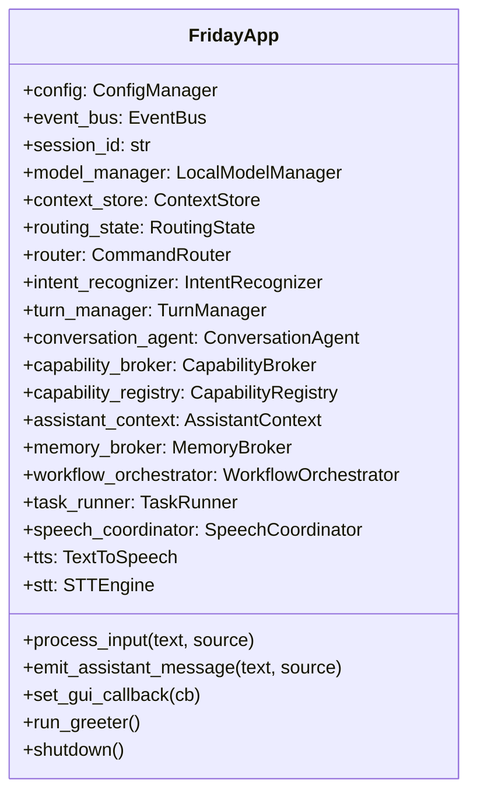

### Wiring order (abbreviated)

```
ConfigManager
EventBus
SessionID (UUID)
LocalModelManager            # starts model preload threads
ContextStore                 # SQLite + ChromaDB
FridaySettings               # frozen config snapshot
RoutingState
DialogState
CommandRouter
IntentRecognizer
CapabilityRegistry
CapabilityBroker
AssistantContext
MemoryBroker
PersonaManager
WorkflowOrchestrator
ConversationAgent
TurnManager
SpeechCoordinator
TaskRunner
TextToSpeech                 # piper process
STTEngine                    # sounddevice stream
WakeWordDetector
ExtensionLoader              # loads all modules/
LifecycleManager.start_all()
```

### `process_input(text, source)`

The top-level dispatcher called from CLI, GUI, and STT:

- `source == "voice"` → submits turn to `TaskRunner` (daemon thread, cancellable).
- `source == "text"` or `"gui"` → calls `_execute_turn` directly on the calling thread.

`_execute_turn` handles media control mode override (when a browser media session is active,
certain raw utterances are forwarded directly to `browser_media_service.fast_media_command`
without going through the full routing pipeline).

### `shutdown()`

Ordered teardown: stops STT stream → drains TTS queue → calls `LifecycleManager.stop_all()` → `sys.exit(0)`.

---

## 5. Configuration System

**Path:** `/home/tricky/Friday_Linux/core/config.py`  
**Config file:** `/home/tricky/Friday_Linux/config.yaml`

`ConfigManager` wraps a plain Python dict loaded from YAML. Access uses dot-notation:

```python
config.get("voice.stt_model", "base.en")
config.set("browser_automation.enabled", True)
config.save()   # writes back with yaml.safe_dump
```

Key configuration sections and their defaults:

| Section | Key settings |
|---------|-------------|
| `conversation` | `listening_mode: on_demand`, `online_permission_mode: ask_first`, `wake_session_timeout_s: 12`, `delegate_multi_action_threshold: 2` |
| `models.chat` | `path: models/gemma-2b-it.gguf`, `n_ctx: 4096`, `temperature: 0.7` |
| `models.tool` | `path: models/qwen2.5-7b-instruct.gguf`, `n_ctx: 2048`, `temperature: 0.1` |
| `routing` | `policy: selective_executor`, `tool_timeout_ms: 2500`, `tool_max_tokens: 96` |
| `voice` | `stt_model: base.en`, `stt_compute_type: int8`, `stt_cpu_threads: 8` |
| `gui` | `window_width: 500`, `window_height: 700` |

The typed snapshot `FridaySettings` (see §24) is constructed from `ConfigManager` at startup and
passed to subsystems that need a frozen view.

---

## 6. Turn Pipeline — End-to-End Flow

The full lifecycle of a single spoken command **on the v1 path**. The v2 path replaces
the `IntentRecognizer → CommandRouter` segment with `TurnOrchestrator → IntentEngine →
PlannerEngine` — see §34 for the v2 sequence diagram and §38 for the dispatch fork inside
`TurnManager.handle_turn()` that picks one path per turn.

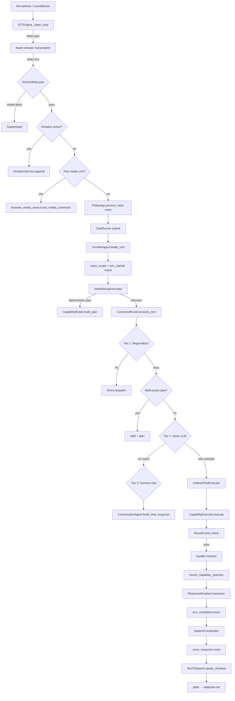

---

## 7. Event Bus

**Path:** `/home/tricky/Friday_Linux/core/event_bus.py`

`EventBus` is a synchronous publish/subscribe bus. All callbacks run on the calling thread
(publish is not async). Per-subscriber exceptions are caught and logged without aborting
the remaining subscribers.

```python
bus.subscribe("voice_response", handler)   # register
bus.publish("voice_response", "Hello, sir") # dispatch to all handlers
```

The `trace_id` from the current `contextvars` context is automatically injected into each
published event payload when a turn is active.

### Defined topics

| Topic | Publisher | Subscribers |
|-------|-----------|------------|
| `voice_response` | TurnManager, tools, event_bus direct | VoiceIOPlugin → TTS |
| `voice_activation_requested` | WakeWordDetector | STTEngine |
| `gui_toggle_mic` | HUD button | STTEngine |
| `conversation_message` | TurnManager | GUI, CLI |
| `voice_runtime_state_changed` | STTEngine | HUD |
| `media_control_mode_changed` | BrowserAutomation | FridayApp |
| `focus_mode_changed` | FocusModeWorkflow | HUD |
| `turn_started` | TurnManager | SpeechCoordinator |
| `assistant_ack` | ConversationAgent | SpeechCoordinator |
| `assistant_progress` | TurnManager | SpeechCoordinator |
| `llm_first_token` | ModelRouter | SpeechCoordinator |
| `turn_completed` | TurnManager | SpeechCoordinator, GUI |
| `turn_failed` | TurnManager | SpeechCoordinator |
| `media_command` | STTEngine fast path | BrowserMediaService |
| `listening_mode_changed` | STTEngine | HUD |

---

## 8. Three-Tier Routing Architecture

**Path:** `/home/tricky/Friday_Linux/core/router.py`

`CommandRouter.process_text()` implements a strict priority waterfall:

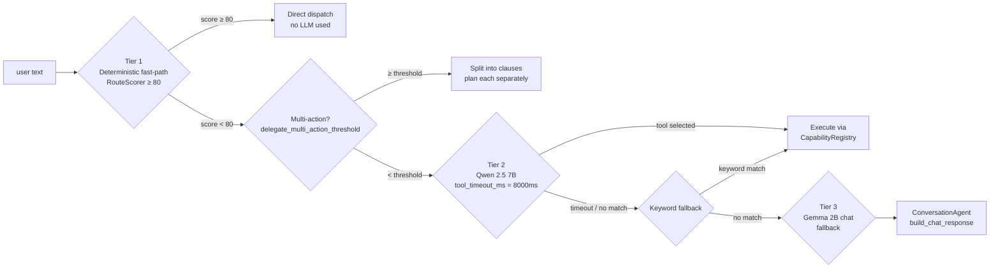

### Inference locking

Both LLM calls are protected by per-domain `RLock` instances. **As of Phase 5 (v2) these
locks live on `LocalModelManager._inference_locks` and are accessed via
`model_manager.inference_lock("chat" | "tool")` — the natural owner of the underlying
llama.cpp instance.** `CommandRouter.chat_inference_lock` and
`CommandRouter.tool_inference_lock` are now `@property` shims that delegate to the
manager, kept for backward compatibility with `LLMChatPlugin` and any test code that
read them on the router. See §36 for the rationale (research-blocks-routing bug) and
the new short-acquire-with-extractive-fallback semantics in `ResearchAgentService`.

### Tool registration

Every module registers tools via:

```python
app.router.register_tool(spec_dict, handler_fn, capability_meta={...})
```

This simultaneously registers the handler in `CapabilityRegistry` and the spec in
`RouteScorer`'s lookup tables (aliases, patterns, context_terms).

---

## 9. Intent Recognition

**Path:** `/home/tricky/Friday_Linux/core/intent_recognizer.py`

`IntentRecognizer.plan(text)` is the deterministic pre-router that runs before any LLM.
It calls 20 `_parse_*` methods in strict priority order and returns a `TurnPlan` if matched.

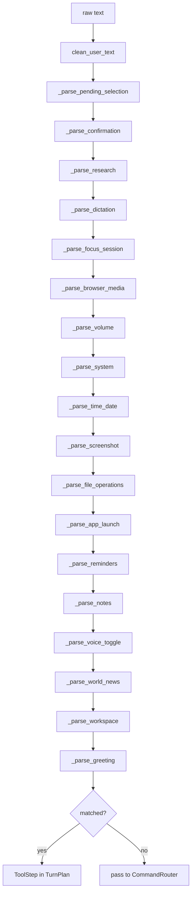

Each parser uses a combination of regex patterns and keyword matching. `_parse_pending_selection`
has highest priority and handles cases where the user is choosing from a previous file
search result list. `_parse_greeting` has lowest priority.

---

## 10. Capability Registry and Broker

### CapabilityRegistry

**Path:** `/home/tricky/Friday_Linux/core/capability_registry.py`

Stores `CapabilityDescriptor` objects (one per registered tool) and dispatches execution
via `CapabilityExecutor.execute()`.

```python
@dataclass
class CapabilityDescriptor:
    name: str
    handler: Callable
    description: str
    parameters: dict
    connectivity: str            # "local" | "online"
    latency_class: str           # "interactive" | "slow" | "background"
    permission_mode: str         # "always_ok" | "ask_first" | "never"
    side_effect_level: str       # "read" | "write" | "critical"
    streaming: bool
```

Connectivity is auto-inferred from the description text if not explicitly set:
if the description contains words like "internet", "web", "online", "search", "gmail",
"fetch", etc., the capability is tagged `connectivity="online"`.

`CapabilityExecutor.execute(descriptor, text, args)` wraps the handler call, catches
exceptions, and returns a string result or error message.

### CapabilityBroker

**Path:** `/home/tricky/Friday_Linux/core/capability_broker.py`

Selects the best capability for a given turn using a 7-step pipeline:

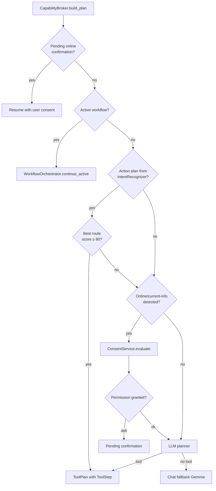

`ToolStep` and `ToolPlan` are dataclasses carrying `(tool_name, args, spoken_ack)`.

---

## 11. Tool Execution Engine

**Path:** `/home/tricky/Friday_Linux/core/tool_execution.py`

There are two interchangeable executors that share the exact same side-effect contract
(cache writes, `response_finalizer.remember_tool_use`, `routing_state.set_decision`,
`memory_service.clear_pending_online`, `memory_broker.record_capability_outcome`,
turn-feedback events):

| Executor | Path | Selected when | Behaviour |
|----------|------|---------------|-----------|
| `OrderedToolExecutor` | `core/tool_execution.py` | `routing.execution_engine: "ordered"` (default) or any single-step plan | Runs `plan.steps` strictly in order on the calling thread. |
| `TaskGraphExecutor` (v2)  | `core/task_graph_executor.py` | `routing.execution_engine: "parallel"` AND `plan.steps` length ≥ 2 | Computes topological waves over `ToolStep.depends_on`, runs each wave concurrently in a `ThreadPoolExecutor(max_workers=4)`. Honours per-step `timeout_ms` and `retries`; injects upstream output into a downstream's args under the upstream's `node_id`. See §35. |

`ConversationAgent._select_executor(plan)` picks one based on the config flag and forwards.
`OrderedToolExecutor._execute_steps(plan)` runs the tool steps sequentially:

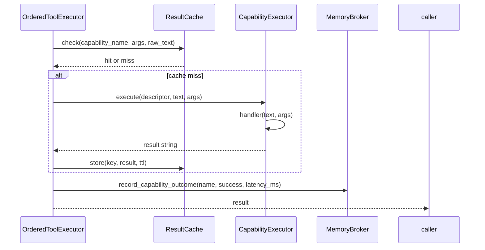

Cache keys are `SHA-256[:24]` of `(capability_name, json(args), raw_text)`.
TTL rules: `write`/`critical` side effects → no cache; `online` → 120s; `local` → 300s.

---

## 12. LLM Stack — Models and Inference

**Path:** `/home/tricky/Friday_Linux/core/model_manager.py`

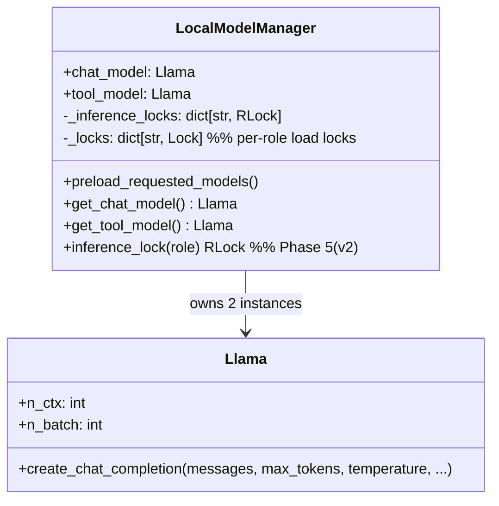

> **Phase 5 (v2) note.** Earlier revisions placed `chat_inference_lock` and
> `tool_inference_lock` on `CommandRouter`. They now live on `LocalModelManager` (the
> object that actually owns the llama.cpp instance the lock protects) and are accessed
> via `manager.inference_lock(role)`. Router properties of the same name are kept as
> backward-compat shims. See §36.

Both models are loaded from `.gguf` files using `llama-cpp-python`. The constructor sets
`n_threads = cpu_count() - 1` to avoid starving the event loop. Model preloading runs on
daemon threads so the app stays responsive during startup.

A custom `llama_log_callback` is installed to suppress noisy native C library log output
from writing to stderr.

### Model roles

| Role | Model | n_ctx | Temperature | Use |
|------|-------|-------|------------|-----|
| `chat` | `gemma-2b-it.gguf` | 4096 | 0.7 | Conversational fallback (Tier 3) |
| `tool` | `qwen2.5-7b-instruct.gguf` | 2048 | 0.1 | Tool selection (Tier 2) |

### Inference configuration (config.yaml routing section)

```yaml
routing:
  tool_timeout_ms: 2500
  tool_max_tokens: 96
  tool_target_max_tokens: 64
  tool_top_p: 0.2
  tool_json_response: true
```

---

## 13. Context and Conversation Management

### AssistantContext

**Path:** `/home/tricky/Friday_Linux/core/assistant_context.py`

Maintains a rolling conversation window (`deque(maxlen=16)`) and builds LLM prompts.

- `clean_user_text(text)` — strips "hey friday", polite prefixes ("please", "could you"),
  and filler words before routing.
- `build_router_prompt(text)` — injects `workflow_summary`, `semantic_recall`, last 4
  history pairs into the Qwen tool-selection prompt.
- `build_chat_messages(text)` — constructs the full alternating `user`/`assistant` pair
  sequence for Gemma. Coerces into strict alternation by dropping consecutive same-role
  turns.

### ConversationAgent

**Path:** `/home/tricky/Friday_Linux/core/conversation_agent.py`

Builds and executes `TurnPlan` objects:

```python
@dataclass
class TurnPlan:
    steps: list[ToolStep]
    final_response: str
    spoken_ack: str
    chat_fallback: bool
```

`build_tool_plan(text)` calls `MemoryBroker.build_context_bundle()`, passes the bundle
to `DelegationManager.route()` (which may involve `PersonaStylistAgent`), then calls
`CapabilityBroker.build_plan()`.

`execute_tool_plan(plan)` delegates to `OrderedToolExecutor` and then calls
`ResponseFinalizer.apply()` on the result.

---

## 14. Memory Architecture

FRIDAY uses a three-tier memory system:

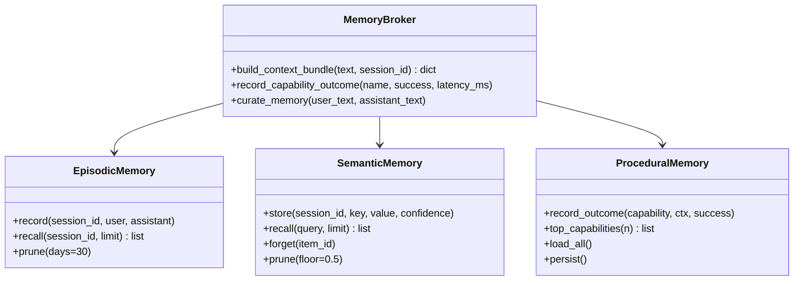

### EpisodicMemory

**Path:** `/home/tricky/Friday_Linux/core/memory/episodic.py`

Records every turn to the `turns` table in SQLite. `recall()` returns a session summary
via `context_store.summarize_session()`. `prune()` deletes rows older than 30 days.

### SemanticMemory

**Path:** `/home/tricky/Friday_Linux/core/memory/semantic.py`

Stores extracted facts with confidence scores in the `facts` table. Item IDs use format
`sem:{session_id}:{key}`. `PRUNE_FLOOR = 0.5` — facts below 50% confidence are removed.
`forget(item_id)` deletes by item ID.

### ProceduralMemory

**Path:** `/home/tricky/Friday_Linux/core/memory/procedural.py`

Thompson-sampling success rates for capabilities. Internal `_rates` dict maps
`(capability_name, ctx_key)` → `(alpha, beta)` counts. Keys stored to the `facts` table
as `proc:{capability}:{ctx[:32]}`. `top_capabilities(n)` returns the n capabilities
with the highest mean success rate.

### MemoryCuratorAgent

**Path:** `/home/tricky/Friday_Linux/core/delegation.py`

Runs after every turn. Extracts user preferences using `SAFE_PATTERNS` regexes:
"my name is", "I like", "I prefer", "call me", "I am from", etc.
Stores extracted facts via `SemanticMemory.store()`.

### Context Bundle

`MemoryBroker.build_context_bundle()` returns:

```python
{
    "persona": PersonaProfile,
    "session_summary": str,
    "active_workflow": WorkflowState | None,
    "semantic_recall": list[Fact],
    "durable_memories": list[Fact],
    "session_state": dict,
    "top_capabilities": list[str],
}
```

### Memory Embeddings

**Path:** `/home/tricky/Friday_Linux/core/memory/embeddings.py`

`get_best_embedder()` tries `BGESmallEmbedder` (BAAI/bge-small-en-v1.5, 384-dim via
sentence-transformers) first, falls back to `HashEmbedder` (SHA-256 → 64-dim float32
tiled vector) if sentence-transformers is unavailable.

---

## 15. Persistence — SQLite and ChromaDB

**Path:** `/home/tricky/Friday_Linux/core/context_store.py`

`ContextStore` owns both storage backends.

### SQLite schema (8 tables)

```sql
CREATE TABLE sessions (
    session_id TEXT PRIMARY KEY,
    started_at TEXT,
    last_active TEXT,
    persona_id TEXT
);

CREATE TABLE turns (
    id INTEGER PRIMARY KEY AUTOINCREMENT,
    session_id TEXT,
    user_text TEXT,
    assistant_text TEXT,
    timestamp TEXT,
    trace_id TEXT
);

CREATE TABLE facts (
    id TEXT PRIMARY KEY,        -- e.g. "sem:...:key" or "proc:..."
    session_id TEXT,
    namespace TEXT,             -- "semantic" | "procedural"
    key TEXT,
    value TEXT,
    confidence REAL,
    updated_at TEXT
);

CREATE TABLE workflow_states (
    session_id TEXT,
    workflow_name TEXT,
    state_json TEXT,
    updated_at TEXT,
    PRIMARY KEY (session_id, workflow_name)
);

CREATE TABLE personas (
    persona_id TEXT PRIMARY KEY,
    name TEXT,
    profile_json TEXT
);

CREATE TABLE reminders (
    id INTEGER PRIMARY KEY AUTOINCREMENT,
    session_id TEXT,
    text TEXT,
    remind_at TEXT,
    done INTEGER DEFAULT 0
);

CREATE TABLE notes (
    id INTEGER PRIMARY KEY AUTOINCREMENT,
    session_id TEXT,
    content TEXT,
    created_at TEXT
);

CREATE TABLE calendar_events (
    id INTEGER PRIMARY KEY AUTOINCREMENT,
    session_id TEXT,
    summary TEXT,
    start_time TEXT,
    end_time TEXT,
    location TEXT,
    description TEXT
);
```

SQLite runs in **WAL mode** for better concurrent read performance.

### ChromaDB

A persistent `chromadb.PersistentClient` stores embedding vectors in `data/chroma/`.
The default collection is `friday_memory`. `HashEmbeddingFunction` (SHA-256 → 64-dim)
is the fallback embedding function when sentence-transformers is unavailable.

`semantic_recall(query, n_results)` calls ChromaDB's `collection.query()` with the
embedded query vector. If ChromaDB returns no results, a fallback token overlap scorer
is used.

---

## 16. Speech Pipeline — STT

**Path:** `/home/tricky/Friday_Linux/modules/voice_io/stt.py`

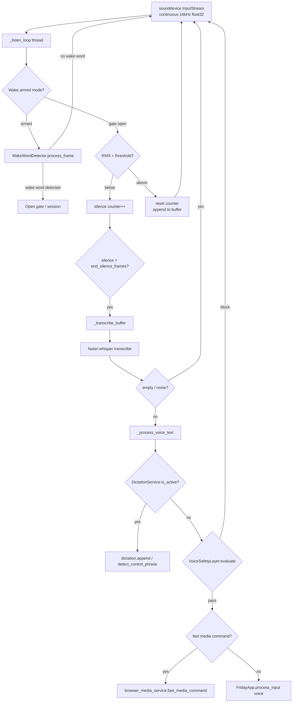

### Key STT parameters

| Parameter | Value |
|-----------|-------|
| Model | `base.en` (faster-whisper) |
| Compute type | `int8` |
| CPU threads | 8 |
| Sample rate | 16000 Hz |
| Frame size | 512 samples |
| VAD RMS threshold | Adaptive (BT vs speaker profile) |
| Wake session timeout | 12 seconds (config) |

### Adaptive profiles

`STTEngine` uses `wpctl` to detect the current active audio source. If a Bluetooth device
is detected, it applies a higher sensitivity profile to compensate for BT audio processing
latency.

### Barge-in

If the user speaks while FRIDAY is speaking, the STT engine detects the overlap via
`tts.is_speaking()` and calls `tts.stop()` before dispatching the new turn, ensuring
the previous response is interrupted cleanly.

### Media safety gate

`VoiceSafetyLayer.evaluate_media_transcript(text, is_wake_armed)`:
- Allows short transcripts (<= `media_max_uninvoked_words: 4` config) even during media.
- Blocks longer transcripts during active media unless the wake word was recently detected.
- Prevents background music lyrics from being interpreted as commands.

---

## 17. Speech Pipeline — TTS

**Path:** `/home/tricky/Friday_Linux/modules/voice_io/tts.py`

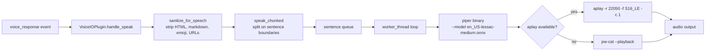

### Key TTS behaviours

- `speak_chunked()` splits the text at sentence boundaries (`.`, `?`, `!`) and queues
  each sentence separately. This allows early interruption mid-response.
- The worker thread processes the sentence queue serially. `interrupt_event` is set by
  `stop()` to terminate the current sentence immediately.
- `speaking_started_at` and `speaking_stopped_at` timestamps support barge-in timing logic.
- `sanitize_for_speech` in `VoiceIOPlugin` strips HTML tags, markdown code fences, emoji,
  bare URLs, and markdown link syntax before handing text to `speak_chunked`.

---

## 18. Wake Word and Clap Detection

### WakeWordDetector

**Path:** `/home/tricky/Friday_Linux/modules/voice_io/wake_detector.py`

Uses `openwakeword` ONNX runtime to detect "hey Friday" from raw PCM frames.

- Input: float32 audio frames from sounddevice InputStream.
- `process_frame(frame)` converts float32 → int16 PCM before passing to
  `openwakeword.Model.predict()`.
- Default confidence threshold: 0.5.
- On detection, publishes `voice_activation_requested` to wake the STT gate.

### Clap Detector

**Path:** `/home/tricky/Friday_Linux/modules/voice_io/clap_detector.py`

A **standalone subprocess** (not a module loaded at runtime) that monitors the microphone
for double-clap patterns using `sounddevice`. Configurable via environment variables:
`CLAP_THRESHOLD`, `CLAP_MIN_GAP_MS`, `CLAP_MAX_GAP_MS`. Logs to `logs/clap_detector.log`.

The `ClapControlSkill` (`skills/clap_control_skill.py`) provides the `toggle_clap_trigger`
voice tool that starts/stops this subprocess and optionally registers it as a systemd or
XDG autostart entry.

---

## 19. Speech Coordination

**Path:** `/home/tricky/Friday_Linux/core/speech_coordinator.py`

`SpeechCoordinator` prevents duplicate speech outputs within a single turn by maintaining
a `SpeechTurnState` per `turn_id`:

```python
@dataclass
class SpeechTurnState:
    turn_id: str
    ack_spoken: bool
    progress_count: int
    final_spoken: bool
    streamed_chunks: int
    interrupted: bool
    spoken_texts: set[str]   # dedup by normalised text key
```

It subscribes to 6 turn events: `turn_started`, `assistant_ack`, `assistant_progress`,
`llm_first_token`, `turn_completed`, `turn_failed`.

`_speak_once(payload, kind)` checks:
1. If the turn has been interrupted (barge-in).
2. If the normalised text was already spoken this turn.
3. If an ack/final was already spoken (only one allowed per turn per kind).

Only then does it publish `voice_response` to trigger TTS.

---

## 20. Extension and Plugin System

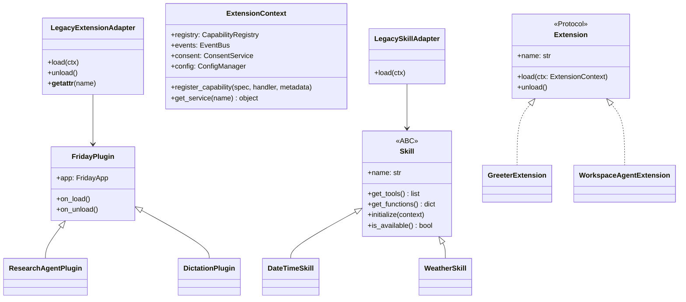

### ExtensionLoader

**Path:** `/home/tricky/Friday_Linux/core/extensions/loader.py`

Scans `modules/` for extension entry points in this priority order:
1. `extension.py` — native `Extension` protocol (preferred).
2. `__init__.py` or `plugin.py` — legacy `FridayPlugin` wrapped by `LegacyExtensionAdapter`.
3. `skills/` subdirectory — `Skill` ABC implementations wrapped by `LegacySkillAdapter`.

`LegacySkillAdapter` calls `skill.is_available()` before registering. If the skill
declares a `SkillDescriptor.supported_platforms` list, it checks `platform.system()`.

### Extension Protocol

**Path:** `/home/tricky/Friday_Linux/core/extensions/protocol.py`

`ExtensionContext.register_capability(spec, handler, metadata)` performs a **dual registration**:
- Registers the descriptor in `CapabilityRegistry`.
- Registers the tool spec (aliases, patterns, context_terms) in `CommandRouter`.

This ensures both the deterministic fast-path scorer and the LLM tool selector are aware
of every registered capability.

### @capability decorator

**Path:** `/home/tricky/Friday_Linux/core/extensions/decorators.py`

```python
@capability(
    name="greet",
    description="Respond to a greeting.",
)
def handle_greeting(self):
    ...
```

Stores `__capability_spec__` and `__capability_meta__` on the function object.
`GreeterExtension.load()` scans `dir(self)` for methods with these attributes and
registers them via `ctx.register_capability()`.

---

## 21. Workflow Orchestration

**Path:** `/home/tricky/Friday_Linux/core/workflow_orchestrator.py`

`WorkflowOrchestrator` manages stateful multi-turn workflows. It owns a registry of
`BaseWorkflow` instances, each handling a specific domain.

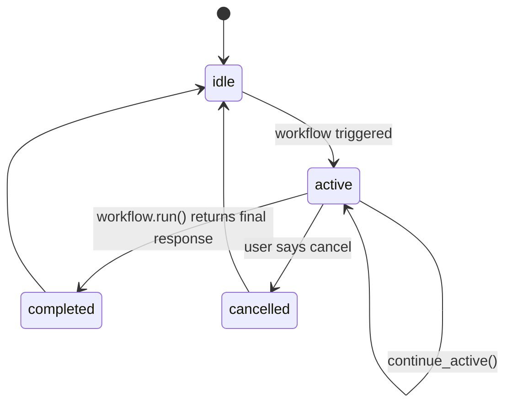

### Built-in workflows

| Workflow name | Class | Trigger | Description |
|---------------|-------|---------|-------------|
| `file` | `FileWorkflow` | File search with multiple candidates | Multi-turn file resolution |
| `browser_media` | `BrowserMediaWorkflow` | Browser media session | Track active media platform |
| `reminder` | `ReminderWorkflow` | Reminder creation | Collect time/date if missing |
| `calendar_event` | `CalendarEventWorkflow` | Calendar creation | Saves pending title/time to `context_store`; follow-up turn is picked up and completes the Google Calendar event |
| `research` | `ResearchWorkflow` | "research X" | DuckDuckGo + arXiv + LLM summarise |
| `focus_mode` | `FocusModeWorkflow` | "start focus session" | GNOME DND + media pause + timer |

### BaseWorkflow + LangGraph

Each `BaseWorkflow` optionally uses a LangGraph `StateGraph` if the `langgraph` package
is available. The `GraphState` dataclass carries:

```python
@dataclass
class GraphState:
    user_text: str
    session_id: str
    response: str
    status: str   # "pending" | "active" | "completed" | "cancelled"
    data: dict
```

When `langgraph` is not installed or `execution_engine != "graph"`, the workflow falls back
to a sequential `OrderedToolExecutor` execution pattern.

### FocusModeWorkflow

**Path:** `/home/tricky/Friday_Linux/core/reasoning/workflows/focus_mode.py`

Global `_focus_state` dict (session_id → dict) tracks per-session focus timers.
`_start()` uses `gsettings` to set `org.gnome.desktop.notifications.show-banners false`.
`_pause_media()` calls `browser_media_service.browser_media_control("pause")`.
A `threading.Timer` fires at session end to restore notifications and announce completion.

---

## 22. Reasoning — Route Scorer, Model Router, Graph Compiler

### RouteScorer

**Path:** `/home/tricky/Friday_Linux/core/reasoning/route_scorer.py`

Deterministic scoring engine for Tier 1 fast-path routing. Populated from registered
tool specs (aliases, regex patterns, context_terms).

Scoring table:

| Match type | Score |
|-----------|-------|
| Exact alias match | 120 |
| Regex fullmatch | 110 |
| Regex search | 90 |
| Alias word boundary | 40 + bonus per word |
| Context term hit | +6 per term |

Threshold for Tier 1 dispatch: **score ≥ 80**.

Built-in aliases cover hundreds of phrases: "what time is it", "battery level",
"system status", "take screenshot", "search for", "play youtube", etc.

### ModelRouter

**Path:** `/home/tricky/Friday_Linux/core/reasoning/model_router.py`

Wraps Qwen 2.5 7B inference with a `ThreadPoolExecutor` timeout:

1. Builds a tool-selection prompt with available tool names, descriptions, and the
   `build_router_prompt()` context from `AssistantContext`.
2. Runs inference with timeout (default `tool_timeout_ms = 2500ms`).
3. `_parse(output)` extracts `{"name": ..., "args": ...}` from the LLM JSON output.
4. Fuzzy-matches unknown tool names using `difflib.get_close_matches` against the
   registered capability list.

### GraphCompiler

**Path:** `/home/tricky/Friday_Linux/core/reasoning/graph_compiler.py`

When `execution_engine = "graph"` is set in config and `langgraph` is installed:

1. Compiles a LangGraph `StateGraph` from a `ToolPlan`.
2. Each `ToolStep` becomes a graph node that calls `CapabilityExecutor.execute()`.
3. Edges are added sequentially.
4. `graph.invoke(initial_state)` executes the compiled plan.

Falls back to `OrderedToolExecutor` if langgraph is missing.

---

## 23. Kernel Services — Consent and Permissions

### ConsentService

**Path:** `/home/tricky/Friday_Linux/core/kernel/consent.py`

Gates online operations according to `online_permission_mode` from config:

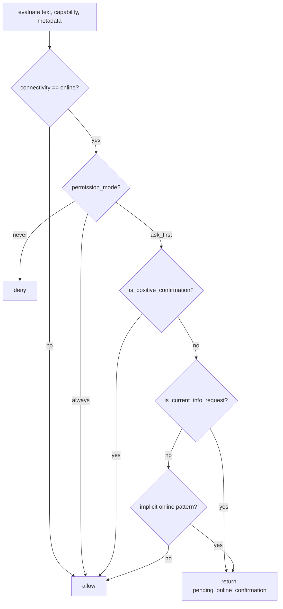

Helper methods:
- `is_positive_confirmation(text)` — checks "yes", "go ahead", "sure", "do it", etc.
- `is_negative_confirmation(text)` — checks "no", "cancel", "stop", "never mind", etc.
- `is_current_info_request(text)` — detects "what is the weather", "latest news",
  "current price", etc. using a regex list of online-intent patterns.

### PermissionService

**Path:** `/home/tricky/Friday_Linux/core/kernel/permissions.py`

`PermissionTier` enum: `READ` / `WRITE` / `CRITICAL`.

`_ALWAYS_CRITICAL` frozenset lists capability names that always require explicit consent:
`shutdown_assistant`, `manage_file` (when action is delete), `create_calendar_event`.

`infer_side_effect_level(name, description)` performs text heuristics:
- `"delete"`, `"remove"`, `"shutdown"` → `CRITICAL`
- `"write"`, `"create"`, `"save"`, `"send"` → `WRITE`
- Otherwise → `READ`

---

## 24. Bootstrap Layer — Container, Lifecycle, Settings

### Container

**Path:** `/home/tricky/Friday_Linux/core/bootstrap/container.py`

A minimal singleton DI container. Services are registered as factories:

```python
container.register("event_bus", lambda: EventBus(), lifecycle=True)
bus = container.get("event_bus")   # creates once, returns cached instance
```

`lifecycle=True` marks the service for ordered startup/shutdown via `LifecycleManager`.

### LifecycleManager

**Path:** `/home/tricky/Friday_Linux/core/bootstrap/lifecycle.py`

Maintains an ordered list of services. `start_all()` iterates forward; `stop_all()`
iterates reversed (LIFO teardown order).

```python
manager.register(stt_engine)
manager.start_all()   # startup
manager.stop_all()    # teardown (STT stops before TTS, etc.)
```

### FridaySettings

**Path:** `/home/tricky/Friday_Linux/core/bootstrap/settings.py`

Frozen dataclasses built from `ConfigManager`:

```python
@dataclass(frozen=True)
class FridaySettings:
    app_name: str
    models: ModelSettings
    routing: RoutingSettings
    conversation: ConversationSettings

@dataclass(frozen=True)
class ModelSettings:
    chat_path: str
    tool_path: str
    n_ctx_chat: int
    n_ctx_tool: int
    ...

@dataclass(frozen=True)
class RoutingSettings:
    policy: str
    tool_timeout_ms: int
    tool_max_tokens: int
    ...
```

`FridaySettings.from_config(config_manager)` is the factory method.

---

## 25. Tracing and Logging

### Tracing

**Path:** `/home/tricky/Friday_Linux/core/tracing.py`

```python
trace_id_var: contextvars.ContextVar[str]
```

`trace_scope(turn_id)` is a context manager that:
1. Sets `trace_id_var` to a new UUID hex[:12].
2. Creates a `TurnTrace` that records events with timestamps.
3. On `__exit__`, exports the trace as a JSONL line to `data/traces.jsonl`.

Every component that runs within a turn (routing, LLM calls, tool execution) automatically
inherits the trace ID via `contextvars` propagation without explicit passing.

### Logger

**Path:** `/home/tricky/Friday_Linux/core/logger.py`

`logger` is a module-level `logging.getLogger("friday")` with:
- `RotatingFileHandler` — 5MB max file size, 3 backup files, stored in `logs/friday.log`.
- `StreamHandler` for console (debug level when `--verbose`).
- `_TraceContextFilter` — adds `trace_id` to every `LogRecord` by reading from `trace_id_var`.

Log format: `%(asctime)s [%(trace_id)s] %(levelname)s %(name)s: %(message)s`

---

## 26. Task Runner and Result Cache

### TaskRunner

**Path:** `/home/tricky/Friday_Linux/core/task_runner.py`

Ensures voice commands are processed one at a time, with barge-in cancellation:

```python
task_runner.submit(turn_fn, turn_id)
```

1. `_cancel_current()` — sets old `cancel_event`, joins with 2-second timeout,
   calls `tts.stop()` to interrupt ongoing speech.
2. Starts a new daemon thread running `turn_fn`.

This means: if the user issues a new command while the previous one is still executing,
the previous turn is cancelled and the new one starts immediately.

### ResultCache

**Path:** `/home/tricky/Friday_Linux/core/result_cache.py`

In-memory TTL cache backed by a `dict`. Cache key: `SHA-256[:24]` of
`(capability_name, json.dumps(args, sort_keys=True), raw_text)`.

TTL policy:
- `side_effect_level == "write"` or `"critical"` → **TTL = 0** (never cached)
- `connectivity == "online"` → **TTL = 120s**
- `connectivity == "local"` → **TTL = 300s**

Expired entries are evicted lazily on `get()`.

---

## 27. Module Catalogue

### Voice I/O Module

#### `modules/voice_io/plugin.py`

`VoiceIOPlugin` (FridayPlugin):
- `sanitize_for_speech(text)` — strips HTML, markdown fences, emoji, URLs, markdown links.
- Registers `enable_voice`, `disable_voice`, `set_voice_mode` capabilities.
- Subscribes to `voice_response` → `handle_speak` → `tts.speak_chunked(text)`.

#### `modules/voice_io/stt.py`

`STTEngine` — the always-on microphone listener:
- Hardware-level `sounddevice.InputStream` is always active.
- Software gate (`is_listening`) controls whether transcriptions are processed.
- Two listening modes: `on_demand` (gate closed until wake word) and `continuous`.
- `_listen_loop()` — VAD using RMS thresholding over 512-sample frames.
- `_transcribe_buffer()` — runs `faster_whisper.WhisperModel.transcribe()` on the
  accumulated audio buffer.
- `_process_voice_text(text)` — dictation override → safety gate → fast media path
  → full turn dispatch.

#### `modules/voice_io/tts.py`

`TextToSpeech`:
- Subprocess: `piper --model en_US-lessac-medium.onnx --output_raw | aplay ...`
- `speak_chunked(text)` — splits on sentence endings, queues chunks.
- Worker thread drains the sentence queue serially.
- `interrupt_event.set()` stops playback between sentences.

#### `modules/voice_io/wake_detector.py`

`WakeWordDetector`:
- `openwakeword.Model(wakeword_models=["models/hey_friday.onnx"])`.
- `process_frame(frame)` — converts float32 → int16, calls `model.predict(chunk)`.
- Returns True when prediction score > 0.5.

#### `modules/voice_io/clap_detector.py`

Standalone script. Monitors sounddevice for amplitude spikes matching double-clap pattern.
Configurable via `CLAP_THRESHOLD`, `CLAP_MIN_GAP_MS`, `CLAP_MAX_GAP_MS` env vars.

#### `modules/voice_io/audio_devices.py`

`list_audio_input_devices()` — tries PipeWire (`wpctl status`) first, falls back to
`sounddevice.query_devices()`. Returns `list[AudioInputDevice]`.

`parse_wpctl_inputs(text)` — parses `wpctl status` stdout, recognises Sources and Filter
sections. `_humanize_filter_label()` converts Bluetooth/ALSA node names to readable labels.

`choose_startup_input_device(devices)` — ranks devices by `_startup_input_rank()`:
prioritises built-in over generic mic over Bluetooth, penalises virtual/loopback sources.

#### `modules/voice_io/safety.py`

`VoiceSafetyLayer.evaluate_media_transcript(text, wake_armed)`:
- Returns `True` (allow) if: no media active, text is short enough, or wake armed.
- Returns `False` (block) if: media active AND text > `media_max_uninvoked_words` AND
  wake not recently armed.

---

### System Control Module

**Path:** `/home/tricky/Friday_Linux/modules/system_control/`

#### `plugin.py`

`SystemControlPlugin` registers 20+ capabilities and attaches `WorkspaceFileController`
to `app.file_controller`:

| Capability | Description |
|-----------|-------------|
| `get_system_status` | CPU + RAM + battery summary |
| `get_friday_status` | FRIDAY version, loaded modules, uptime |
| `get_battery` | Battery percentage and charging status |
| `get_cpu_ram` | CPU percentage and RAM usage |
| `launch_app` | Launch application by name |
| `set_volume` | Adjust system volume via wpctl/pactl |
| `take_screenshot` | gnome-screenshot or scrot |
| `search_file` | Fuzzy file search in home tree |
| `open_file` | xdg-open a file |
| `read_file` | Return file content as text |
| `summarize_file` | LLM-assisted file summarisation |
| `manage_file` | Create or append to text files |
| `list_folder_contents` | Directory listing |
| `open_folder` | Nautilus/Nemo/xdg-open directory |
| `select_file_candidate` | Choose from multi-result file search |
| `confirm_yes` / `confirm_no` | Resolve pending clarifications |
| `shutdown_assistant` | Graceful FRIDAY shutdown |

#### `app_launcher.py`

`AppLaunchTarget` dataclass. `APP_PREFERENCES` table maps canonical app names to
alternative executable commands (e.g. chrome → google-chrome-stable). Fuzzy matching
via `difflib.get_close_matches()` when exact match fails.

#### `file_search.py`

`search_files_raw(filename, search_dir, extension, limit)` — walks the home directory
tree respecting `SKIPPED_DIR_NAMES` and `SKIPPED_DIR_PREFIXES`. Times out at
`DEFAULT_SEARCH_TIMEOUT_S` (6 seconds, overridable by env var). Returns ranked list of
absolute paths using fuzzy score from `difflib.SequenceMatcher`.

#### `file_workspace.py`

`WorkspaceFileController` — stateful controller for multi-step file operations:
- `FileLookupRequest` — carries filename, folder, extension, requested_actions.
- `FileManageRequest` — carries action, content, filename.
- Keeps `PendingFileRequest` state between turns so "open that file" works after
  "search for config.yaml".

#### `sys_info.py`

`get_battery_status()`, `get_cpu_ram_status()`, `get_system_status()` — thin wrappers
around `psutil`.

---

### Browser Automation Module

**Path:** `/home/tricky/Friday_Linux/modules/browser_automation/`

#### `plugin.py`

`BrowserAutomationPlugin` registers 5 capabilities:
`open_browser_url`, `play_youtube`, `play_youtube_music`, `browser_media_control`,
`search_google`. Stores the service as `app.browser_media_service`.
Registers a `_BrowserShutdown` lifecycle hook that calls `service.shutdown()` on exit.

#### `service.py`

`BrowserMediaService` — all Playwright operations run on a single dedicated daemon thread
(`friday-browser`) to satisfy Playwright's thread-affinity requirement.

Architecture:
```
public methods → _submit(fn, *args) → _Job on Queue → _worker_loop → fn(*args)
```

`_submit()` blocks on `future.result(timeout)`. If called from within the worker thread
itself (re-entrant path), it runs inline to avoid deadlock.

Key operations:
- `play_youtube(query)` / `play_youtube_music(query)` — search then click first result.
- `browser_media_control(action)` — pause/resume/next/previous/seek via JavaScript
  DOM manipulation (`media.pause()`, `media.play()`, `media.currentTime`).
- `fast_media_command(action)` — hot path from STT, uses `FAST_TIMEOUT_S = 8s`.
- `_keep_playing_script` — injected JS overrides `document.hidden` so backgrounded
  tabs don't auto-pause.
- Profile management: tries system Chrome profile first, clones it to
  `~/.cache/friday/browser-profile/chrome-system-clone/` to avoid
  `SingletonLock` conflicts, falls back to isolated profile.
- `_focus_browser_window()` — uses `wmctrl` and `xdotool` on Linux to raise and
  maximise the Chrome window.

---

### Task Manager Module

**Path:** `/home/tricky/Friday_Linux/modules/task_manager/plugin.py`

SQLite-backed reminders, notes, and local calendar events. Extensive time parsing:

- `TIME_RE` — matches `3pm`, `3:30 PM`, `15:00`.
- `RELATIVE_RE` — matches `in 5 minutes`, `in 2 hours`.
- `WEEKDAYS` — maps day names to next occurrence.
- `MONTHS` — maps month names for absolute dates.

Registered capabilities: `set_reminder`, `save_note`, `read_notes`,
`create_calendar_event`, `move_calendar_event`, `cancel_calendar_event`, `get_agenda`.

---

### LLM Chat Module

**Path:** `/home/tricky/Friday_Linux/modules/llm_chat/plugin.py`

`LLMChatPlugin.handle_chat(text, args)`:
1. Acquires `app.chat_inference_lock` (RLock).
2. Calls `assistant_context.build_chat_messages(text)`.
3. Runs `llm.create_chat_completion(messages, max_tokens=200)`.
4. Returns the completion text.

This is the Tier 3 fallback for any text that doesn't match a tool.

---

### Greeter Module

**Path:** `/home/tricky/Friday_Linux/modules/greeter/extension.py`

`GreeterExtension` (native Extension protocol):
- `handle_greeting()` — picks a random JARVIS-style greeting based on time of day.
- `handle_help()` — generates a dynamic help text from `CapabilityRegistry.list_capabilities()`,
  grouped by `HELP_CATEGORY_SPECS` (8 categories). Only shows categories whose tools are
  actually registered.
- `handle_startup()` — startup greeting with optional unfinished task briefing.
- `get_pause_phrase()` / `get_unpause_phrase()` — randomised reactor-click feedback phrases.

---

### Research Agent Module

**Path:** `/home/tricky/Friday_Linux/modules/research_agent/`

#### `plugin.py`

`ResearchAgentPlugin.handle_research(text, args)`:
1. Extracts topic from text or args.
2. Calls `ResearchAgentService.start_research(topic, max_sources=5)`.
3. Returns an immediate acknowledgement while research runs in a background thread.
4. On completion, `_announce_completion()` calls `app.emit_assistant_message()` or
   falls back to `bus.publish("voice_response", message)`.

#### `service.py`

`ResearchAgentService`:
1. **Search phase** — DuckDuckGo HTML scraping (`duckduckgo-search` library) +
   arXiv RSS via `feedparser`.
2. **Fetch phase** — `ThreadPoolExecutor(max_workers=3)` parallel HTTP fetch of top
   `max_sources` URLs; each source runs `_fetch_and_summarize()` concurrently.
3. **Extract phase** — `html2text` converts HTML to Markdown for readability.
4. **Summarise phase** — per-source LLM summarisation. `_get_llm()` returns
   `(llm, lock)` preferring the Qwen 7B tool LLM (`tool_inference_lock`) over the
   Gemma 2B chat LLM (`chat_inference_lock`). `_run_with_lock(lock, fn)` enforces a
   45-second acquisition timeout; on timeout it falls back to a raw text snippet so
   research always completes even under heavy inference load.
5. **Write phase** — outputs to `~/Documents/friday-research/<slug>/`:
   - `00-summary.md` — synthesis briefing.
   - `01-<source>.md`, `02-<source>.md`, ... — per-source notes.
   - `sources.md` — raw URL list.

`max_sources` is clamped to `[1, 10]`; non-integer values fall back to `5`.

---

### Workspace Agent Module

**Path:** `/home/tricky/Friday_Linux/modules/workspace_agent/`

#### `extension.py`

`WorkspaceAgentExtension` — 9 capabilities wrapping Google Workspace:

| Capability | Permission | Description |
|-----------|-----------|-------------|
| `check_unread_emails` | always_ok | List unread Gmail messages |
| `read_latest_email` | always_ok | Read most recent unread email body |
| `read_email` | always_ok | Read email by message ID |
| `get_calendar_today` | always_ok | Today's Calendar events |
| `get_calendar_week` | always_ok | This week's Calendar events |
| `get_calendar_agenda` | always_ok | Next N days' events |
| `create_calendar_event` | ask_first | Create a new Calendar event |
| `search_drive` | always_ok | Search Drive by name/content |
| `daily_briefing` | always_ok | Email + calendar morning summary |

`create_calendar_event` resolves times by: ISO 8601 args first → natural language via
`task_manager._parse_datetime_parts()` → saves pending workflow state if time is missing.

#### `gws_client.py`

Thin subprocess wrapper around the `gws` CLI. `_run(*args)` calls
`subprocess.run([gws_path, *args], capture_output=True, timeout=20)` and parses JSON output.
`GWSError` is raised on non-zero exit or `{"error": ...}` in response.

Functions: `gmail_list_unread`, `gmail_read`, `gmail_send`, `calendar_agenda`,
`calendar_create_event`, `drive_list_files`.

---

### Dictation Module

**Path:** `/home/tricky/Friday_Linux/modules/dictation/`

#### `plugin.py`

`DictationPlugin` registers: `start_dictation`, `end_dictation`, `cancel_dictation`.

#### `service.py`

`DictationService`:
- `DictationSession` dataclass: `label`, `started_at`, `file_path`, `chunks: list[str]`.
- `start(label)` — creates a timestamped `.md` file in `~/Documents/friday-memos/`.
- `stop()` — joins chunks, capitalises first word, adds trailing period, writes file.
- `cancel()` — discards session without writing.
- `append(text)` — adds a raw transcript chunk during active session.
- `detect_control_phrase(text)` — checks `END_PHRASES` and `CANCEL_PHRASES` lists.
- `strip_control_phrase(text)` — removes control phrases from a transcript chunk before
  appending to the memo.

The STT engine checks `dictation_service.is_active()` before processing each transcript
and routes accordingly.

---

### Focus Session Module

**Path:** `/home/tricky/Friday_Linux/modules/focus_session/plugin.py`

`FocusSessionPlugin` (FridayPlugin):
- Registers: `start_focus_session`, `end_focus_session`, `focus_session_status`.
- All handlers delegate to `workflow_orchestrator.workflows["focus_mode"]`.
- The workflow owns all state (active timers, GNOME settings backup).

---

### World Monitor Module

**Path:** `/home/tricky/Friday_Linux/modules/world_monitor/`

#### `plugin.py`

`WorldMonitorPlugin` registers `get_world_monitor_news` with 23 aliases and 5 regex
patterns. Infers category from text (`tech`, `finance`, `commodity`, `energy`, `good`,
default `global`). On a successful result, opens the WorldMonitor dashboard in the
browser (via `browser_media_service.open_browser_url()`) and publishes speech segments
directly to `voice_response`.

#### `service.py`

`WorldMonitorService` — multi-strategy news fetcher:

```
Strategy 1: /api/news/v1/list-feed-digest  (JSON feed API)
Strategy 2: HTML scraping of category sites  (BeautifulSoup-style parser)
Strategy 3: /api/bootstrap?keys=insights    (full API with api_key)
```

`_VisibleTextParser(HTMLParser)` — extracts visible text from WorldMonitor HTML pages,
skipping `script`, `style`, `noscript`, `svg` tags. Detects headlines, sources, ages.

Article scoring (`_article_priority`) rewards: breaking/critical keywords (+1 each),
alert flag (+5), threat levels (critical +4, high +3, medium +1).

Output format: `speech_segments` list for voice + `display_text` for GUI.

---

## 28. Skills Catalogue

Skills are legacy `Skill` ABC implementations loaded via `LegacySkillAdapter`.
They are available for use but most functionality has been superseded by the
plugin/extension architecture.

| File | Class | Tools | Platform |
|------|-------|-------|---------|
| `datetime_ops.py` | `DateTimeSkill` | `get_current_datetime`, `get_current_time`, `get_current_date` | Any |
| `weather_ops.py` | `WeatherSkill` | `get_weather`, `get_current_location_weather` | Any (needs API key) |
| `memory_ops.py` | `MemorySkill` | `remember_fact`, `retrieve_memory`, `list_all_memories`, `forget_fact` | Any (JSON file) |
| `system_ops.py` | `SystemSkill` | `set_volume`, `open_app` | macOS targeted |
| `web_ops.py` | `WebSkill` | `google_search` | Any (webbrowser module) |
| `file_ops.py` | `FileSkill` | File read/write primitives | Any |
| `text_ops.py` | `TextSkill` | Text manipulation utilities | Any |
| `screenshot_ops.py` | `ScreenshotSkill` | `take_screenshot` | Linux |
| `clap_control_skill.py` | `ClapControlSkill` | `toggle_clap_trigger` | Linux |
| `camera_skill.py` | `CameraSkill` | Camera capture | Linux (OpenCV) |
| `detection_skill.py` | `DetectionSkill` | Object detection | Linux (YOLO) |
| `vision_skill.py` | `VisionSkill` | Image analysis | Linux |
| `gemini_live_skill.py` | `GeminiLiveSkill` | `start_live_vision` | Any (Gemini API) |
| `email_ops.py` | `EmailSkill` | Email send/read | Any (SMTP/IMAP) |
| `whatsapp_skill.py` | `WhatsAppSkill` | WhatsApp messaging | Linux (Selenium) |

### `ClapControlSkill` detail

`toggle_clap_trigger(enabled, permanent)`:
- `enabled=True` → starts `clap_detector.py` as a subprocess.
- `enabled=False` → stops it with `--stop` argument.
- `permanent=True` → also runs `register_autostart.py` to add/remove XDG autostart entry.

### `MemorySkill` note

This legacy skill stores memories in `~/.jarvic_memory.json` (note the original JARVIS
typo). It is superseded by the three-tier `ContextStore`-backed memory system but
remains available for backward compatibility.

---

## 29. CLI and GUI Interfaces

### Terminal UI

**Path:** `/home/tricky/Friday_Linux/cli/terminal_ui.py`

`FridayTerminalUI` uses `prompt_toolkit` for a full-featured terminal UI:

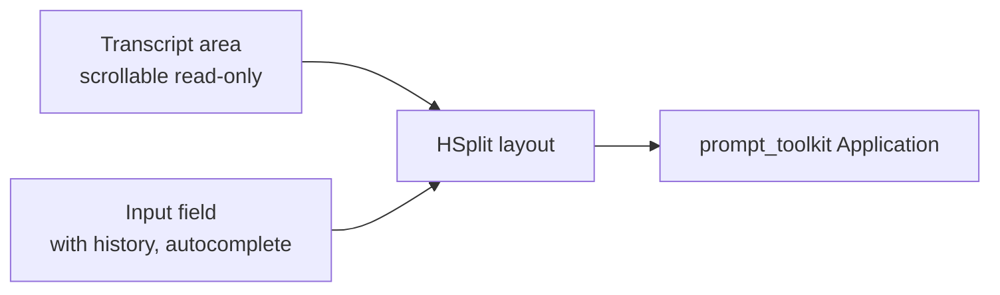

Key features:
- `SLASH_COMMANDS` autocomplete: `/help`, `/clear`, `/stop`, `/voice on|off|toggle`,
  `/status`, `/gui`, `/exit`.
- `_accept_input(buffer)` — dispatches text to `app.process_input(text, source="text")`.
- `_pending_ui_updates` queue — background threads post messages safely.
- `deque(maxlen=400)` transcript history.
- Custom `CLI_STYLE` with dark theme (`#020617` background, `#7dd3fc` prompt).

### MainWindow (legacy PyQt5)

**Path:** `/home/tricky/Friday_Linux/gui/main_window.py`

Original Qt5 GUI. `InputWorker(QObject)` runs `process_input()` in a `QThread` to avoid
blocking the UI thread. `message_ready(pyqtSignal)` marshals results back to the main
thread for `QTextEdit` updates. Contains a companion display (`( ^_^ )` face symbol).

### HUD (PyQt6 full dashboard)

**Path:** `/home/tricky/Friday_Linux/gui/hud.py`

A rich Qt6 HUD with multiple panels:

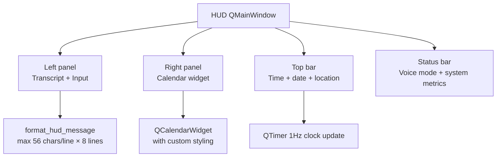

Visual theme: deep space dark (`BG = "#020104"`) with cyan/purple accents
(`CYAN = "#4deaff"`, `PURPLE = "#b95cff"`). Custom `QPainter`-drawn elements
(animated arcs, particle effects). Hardcoded Nellore, AP, India coordinates for
local weather display.

`format_hud_message(role, text)` truncates to `HUD_TEXT_MAX_CHARS = 420` characters
and `HUD_TEXT_MAX_LINES = 8` lines, wrapping at 56 characters per line.

The HUD subscribes to all relevant EventBus topics via the `app.event_bus` to update
panels in real time.

---

## 30. Testing Architecture

The test suite lives in `tests/` and uses `pytest`.

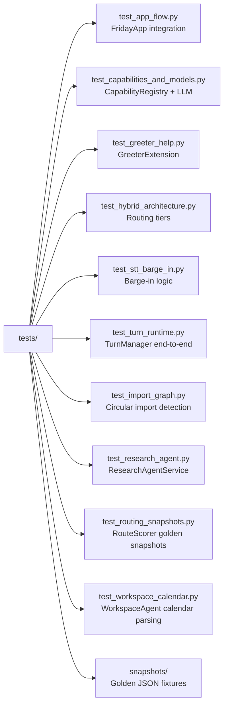

### Test patterns

**`test_app_flow.py`** — constructs a `FridayApp` with mock STT/TTS, fires a text input,
asserts the response event was published.

**`test_routing_snapshots.py`** — loads golden JSON fixtures from `tests/snapshots/` and
asserts `RouteScorer.score()` returns the expected tool for each input phrase.

**`test_hybrid_architecture.py`** — tests all three routing tiers with mock models:
Tier 1 (regex hit), Tier 2 (mock Qwen output), Tier 3 (chat fallback).

**`test_stt_barge_in.py`** — exercises `STTEngine` barge-in detection: asserts that
`tts.stop()` is called when voice arrives during speech.

**`test_import_graph.py`** — walks all Python files using `ast.parse` and checks for
circular imports.

**`test_workspace_calendar.py`** — exercises `WorkspaceAgentExtension._resolve_event_times()`
with natural language dates: "tomorrow at 3pm", "next Friday at 9", "in 2 hours".

As of 2026-05-01, 333 tests pass, 1 skipped.

---

## Appendix A — Deep Dives

### A.1 TurnManager in detail

**Path:** `/home/tricky/Friday_Linux/core/turn_manager.py`

`TurnManager.handle_turn(text, source)` is the authoritative per-turn orchestrator.
It wraps everything inside `trace_scope(turn_id)` so every log line, event, and
database write for a given command shares one traceable ID.

Step-by-step walkthrough:

```
1. feedback.start_turn(text, source)
   → creates TurnRecord with UUID, timestamps, source label

2. context_store.get_session_state(session_id)
   → loads persisted session dict; writes last_source

3. if capability_registry.list_capabilities() empty:
       router.process_text(text)        ← legacy bare routing
   else:
       conversation_agent.build_tool_plan(text, source, turn)

4. If plan has ack → feedback.emit_ack(turn, plan.ack)
   → publishes assistant_ack event → SpeechCoordinator

5. If latency is "slow" / "generative" / "background":
       feedback.start_progress_timers(turn)
   → fires progress events at config.conversation.progress_delays_s intervals

6. conversation_agent.execute_tool_plan(plan, text, turn)
   → runs OrderedToolExecutor, returns response string

7. conversation_agent.curate_memory(text, response, context_bundle)
   → MemoryCuratorAgent extracts facts, EpisodicMemory records turn

8. speak_final = not routing_state.voice_already_spoken
   → if a tool already published voice_response, skip re-speaking final response

9. feedback.complete_turn(turn, response, speak_final, ok=True)
   → publishes turn_completed event → SpeechCoordinator → TTS
```

On exception: `feedback.fail_turn(turn, error_str)` publishes `turn_failed`, which
triggers a generic "I ran into a problem" voice response.

### A.2 ConversationAgent in detail

**Path:** `/home/tricky/Friday_Linux/core/conversation_agent.py`

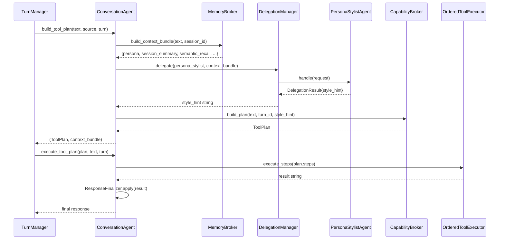

`TurnPlan` fields:
- `steps` — list of `ToolStep` (capability_name, args, raw_text).
- `ack` — acknowledgement phrase to speak before execution (e.g. "Searching for that...").
- `mode` — `"tool"` | `"reply"` | `"chat"`.
- `reply` — pre-computed reply for `"reply"` mode (workflow continuation).
- `estimated_latency` — `"interactive"` | `"slow"` | `"background"`.
- `requires_confirmation` — True if ConsentService flagged an online tool.
- `final_style` — persona style hint string for response formatting.

### A.3 CapabilityBroker 7-step pipeline in detail

**Path:** `/home/tricky/Friday_Linux/core/capability_broker.py`

```python
def build_plan(text, turn_id, source, context_bundle, style_hint) -> ToolPlan:
    cleaned = _clean(text, source)

    # Step 1: Pending online confirmation
    if pending_online in routing_state:
        if consent_service.is_positive_confirmation(cleaned):
            return resume pending plan
        if consent_service.is_negative_confirmation(cleaned):
            routing_state.clear_pending_online()
            return reply("Understood. I won't proceed.")
        # ambiguous — re-ask
        return reply(pending_prompt)

    # Step 2: Active workflow
    result = workflow_orchestrator.continue_active(cleaned, session_id)
    if result.handled:
        return ToolPlan(mode="reply", reply=result.response)

    # Step 3: Multi-action plan from IntentRecognizer
    actions = intent_recognizer.plan(cleaned)
    if actions:
        steps = [action_to_step(a) for a in actions]
        if any step needs online consent:
            return build_online_proposal(step)
        return ToolPlan(mode="tool", steps=steps)

    # Step 4: Deterministic best-route (RouteScorer score >= 80)
    best = route_scorer.best_match(cleaned)
    if best and best.name != "llm_chat":
        if needs_consent(best):
            return build_online_proposal(step)
        return ToolPlan(mode="tool", steps=[route_to_step(best)])

    # Step 5: Online/current-info detection
    if consent_service.is_current_info_request(cleaned):
        return build_online_proposal(online_tool, cleaned)

    # Step 6: LLM planner (ModelRouter via CommandRouter)
    tool_name, args = model_router.select(cleaned, available_tools)
    if tool_name and tool_name != "llm_chat":
        return ToolPlan(mode="tool", steps=[ToolStep(tool_name, args)])

    # Step 7: Chat fallback (Gemma 2B)
    return ToolPlan(mode="chat", chat_fallback=True)
```

The `_ack_for_steps(steps, text)` helper chooses an acknowledgement phrase based on the
first step's capability name. It uses the `DialogueManager._ack_from_text()` to match
domain-specific templates (e.g. "Playing that for you..." for YouTube, "On it, sir."
for generic tools).

### A.4 DelegationManager and Agent Architecture

**Path:** `/home/tricky/Friday_Linux/core/delegation.py`

`DelegationManager` is a lightweight internal agent dispatcher:

| Agent | Class | Responsibility |
|-------|-------|---------------|
| `planner` | `PlannerAgent` | Splits multi-action text into tool calls |
| `workflow` | `WorkflowAgent` | Continues or starts a workflow |
| `research` | `ResearchAgent` | Routes to research capabilities |
| `persona_stylist` | `PersonaStylistAgent` | Extracts tone/style hints from PersonaProfile |
| (implicit) | `MemoryCuratorAgent` | Post-turn fact extraction |

`PersonaStylistAgent.handle()` reads the `persona` dict from `context_bundle` and
constructs a `style_hint` string:
```
"Identity: FRIDAY. Tone: professional and calm. Conversation style: natural and concise. 
 Tool acknowledgements: brief and reassuring."
```
This style hint is passed to `CapabilityBroker` and ultimately reaches `ResponseFinalizer`
to influence the phrasing of final responses.

`MemoryCuratorAgent.SAFE_PATTERNS` regex patterns run post-turn on every user utterance:
- `my name is X` → stores `name: X` in `facts` table (`namespace="profile"`)
- `call me X` → stores `preferred_name: X`
- `I like X` → stores `likes: X`
- `I prefer X` → stores `preference: X`
- `my favorite X is Y` → stores `favorite_X: Y`
- `remember / note that / save this memory: X` → stores in episodic memory with
  `sensitivity="explicit_user"`

### A.5 ResponseFinalizer

**Path:** `/home/tricky/Friday_Linux/core/response_finalizer.py`

`ResponseFinalizer.apply(result, text, routing_state)`:
1. Calls `humanize_tool_result(result)` — converts structured returns like `{"status": "ok", "message": "..."}` to plain strings.
2. Detects "Would you like me to search for..." patterns → sets `pending_clarification` on `dialog_state`.
3. Detects "Is that what you meant?" patterns → sets `pending_clarification`.
4. Returns the cleaned, humanised response string.

`pending_clarification` stored in `DialogState`:
```python
@dataclass
class PendingClarification:
    action_text: str        # the original user command
    prompt: str             # the clarification question
    cancel_message: str     # spoken if user says "no"
```

On the next turn, if `dialog_state.has_pending_clarification()` is True, the broker
checks `is_positive_confirmation` to proceed or `is_negative_confirmation` to cancel.

### A.6 RoutingState

**Path:** `/home/tricky/Friday_Linux/core/routing_state.py`

`RoutingState` is a lightweight mutable object on `app.routing_state`:

```python
@dataclass
class RoutingDecision:
    source: str             # "deterministic" | "qwen_lm" | "keyword" | "gemma_chat"
    tool_name: str
    args: dict
    spoken_ack: str

class RoutingState:
    last_decision: RoutingDecision | None
    current_route_source: str
    current_model_lane: str     # "chat" | "tool" | "none"
    voice_already_spoken: bool  # True if a tool already emitted voice_response

    def mark_voice_spoken(self):
        self.voice_already_spoken = True

    def reset_for_turn(self):
        self.voice_already_spoken = False
        self.last_decision = None
```

`mark_voice_spoken()` is called by tools (like `WorldMonitorPlugin`) that directly publish
`voice_response` events. `TurnManager` checks this flag before deciding whether to speak
the final response through `SpeechCoordinator`, avoiding double-speak.

### A.7 Dialogue Manager

**Path:** `/home/tricky/Friday_Linux/core/dialogue_manager.py`

18 domain-specific acknowledgement templates mapped by keyword sets:

| Domain | Keywords | Ack example |
|--------|---------|-------------|
| file_search | `search, find, look for` | "Searching for that, sir..." |
| file_open | `open, launch` | "Opening that now..." |
| reminder | `remind, reminder` | "Setting that reminder..." |
| browser | `youtube, music, browser` | "Playing that for you..." |
| research | `research, briefing` | "Starting research on that..." |
| calendar | `calendar, schedule, event` | "Adding that to your calendar..." |
| email | `email, gmail, inbox` | "Checking your email..." |
| weather | `weather` | "Checking the weather..." |
| system | `cpu, ram, battery, status` | "Checking system status..." |
| screenshot | `screenshot` | "Taking a screenshot..." |
| volume | `volume, mute` | "Adjusting volume..." |
| note | `note, save` | "Saving that note..." |
| news | `news, worldmonitor` | "Fetching the latest news..." |
| focus | `focus, pomodoro` | "Starting your focus session..." |
| (default) | — | "On it, sir." |

`detect_tone(text)` scans for tone markers:
- `frustrated` — "this isn't", "nothing works", "keep failing", "why does this".
- `urgent` — "quickly", "asap", "right now", "emergency", "hurry".

`adapt_response(response, tone)` modifies the response:
- Frustrated → prepends "I understand your frustration. Let me try a different approach..."
- Urgent → prepends "Right away, sir."

### A.8 PersonaManager

**Path:** `/home/tricky/Friday_Linux/core/persona_manager.py`

`PersonaProfile` dataclass:
```python
@dataclass
class PersonaProfile:
    persona_id: str
    display_name: str
    tone_traits: str          # e.g. "professional, calm, witty"
    conversation_style: str   # e.g. "natural and concise"
    tool_ack_style: str       # e.g. "brief and reassuring"
    memory_style: str         # e.g. "proactive"
    custom_traits: dict
```

`PersonaManager.__init__` ensures `friday_core` default persona exists in the DB.
The `friday_core` persona defines FRIDAY's Jarvis-inspired personality:
- `display_name`: "FRIDAY"
- `tone_traits`: "warm, calm, capable, witty when appropriate"
- `conversation_style`: "natural and concise, uses 'sir' occasionally"
- `tool_ack_style`: "brief, action-oriented"

### A.9 System Capabilities Probe

**Path:** `/home/tricky/Friday_Linux/core/system_capabilities.py`

`SystemCapabilities.probe()` runs once at startup to detect available system capabilities:

Checks 26 Python packages:
`playwright`, `chromadb`, `sounddevice`, `faster_whisper`, `openwakeword`,
`sentence_transformers`, `langgraph`, `psutil`, `PyQt5`, `PyQt6`, etc.

Checks 18 system binaries:
`piper`, `aplay`, `pw-cat`, `wpctl`, `pactl`, `gnome-screenshot`, `scrot`,
`wmctrl`, `xdotool`, `google-chrome`, `chromium`, `gws`, etc.

Scans `/usr/share/applications/` for installed desktop apps.

Registers a `skill_status` capability that returns a formatted availability report.
The result influences which capabilities are active and which are silently skipped during
`LegacySkillAdapter` loading.

---

## Appendix B — Key Data Flow Diagrams

### B.1 Memory write path

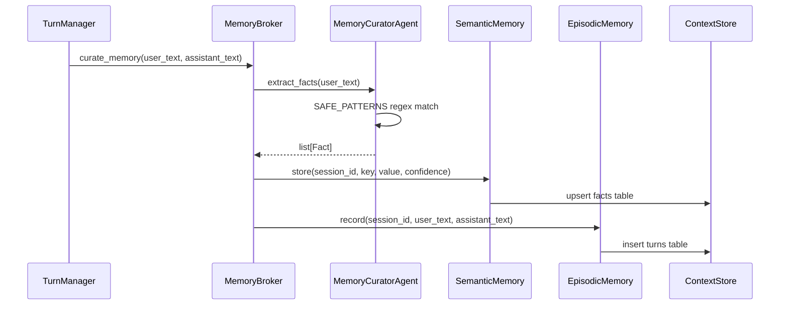

### B.2 Online permission flow

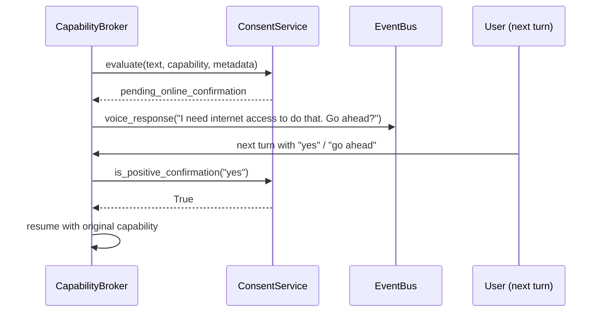

### B.3 Workflow state machine (CalendarEventWorkflow)

```mermaid
stateDiagram-v2
    [*] --> collecting_title : create_calendar_event triggered
    collecting_title --> collecting_time : title extracted from text
    collecting_time --> confirming : start time parsed
    confirming --> writing : ConsentService approved
    writing --> [*] : gws calendar create success
    collecting_title --> [*] : user cancels
    collecting_time --> [*] : user cancels
```

---

## Appendix C — Configuration Reference

Full `config.yaml` with annotations:

```yaml
app:
  name: FRIDAY
  version: '0.1'
  theme: dark

conversation:
  listening_mode: on_demand          # on_demand | continuous
  online_permission_mode: ask_first  # ask_first | always | never
  wake_session_timeout_s: 12         # seconds gate stays open after wake word
  assistant_echo_window_s: 1.8       # seconds to suppress echo of FRIDAY's own voice
  delegate_multi_action_threshold: 2 # min actions before multi-action split

capabilities:
  registry_mode: internal_mcp_compatible
  allow_external_mcp: false
  online_skills_enabled: true

personas:
  default_persona_id: friday_core
  auto_memory_capture: aggressive

models:
  chat:
    path: models/gemma-2b-it.gguf
    preload: true
    n_ctx: 4096
    n_batch: 512
    temperature: 0.7
  tool:
    path: models/qwen2.5-7b-instruct.gguf
    preload: true
    n_ctx: 2048
    n_batch: 256
    temperature: 0.1

routing:
  policy: selective_executor
  tool_timeout_ms: 2500
  tool_max_tokens: 96
  tool_target_max_tokens: 64
  tool_top_p: 0.2
  tool_json_response: true
  execution_engine: ordered          # ordered | graph

gui:
  window_width: 500
  window_height: 700

voice:
  stt_model: base.en
  stt_compute_type: int8
  stt_language: en
  stt_cpu_threads: 8
  wake_model_path: models/hey_friday.onnx
  wake_transcript_fallback: true
  media_max_uninvoked_words: 4
  input_device:
    id: 97
    kind: pipewire
    label: Nirvana Ion

modules:
  greeter:
    enabled: true

skills:
  mode: local_first
  weather:
    api_key: ''
    default_city: Mumbai

browser_automation:
  enabled: true
  allow_online: true
  preferred_browser: chrome
  use_system_profile: true

world_monitor:
  api_base_url: https://api.worldmonitor.app
  web_base_url: https://www.worldmonitor.app
  feed_api_base_url: https://worldmonitor.app
  sources:
    global: https://worldmonitor.app/
    tech: https://tech.worldmonitor.app/
    finance: https://finance.worldmonitor.app/
    commodity: https://commodity.worldmonitor.app/
    energy: https://energy.worldmonitor.app/
    good: https://happy.worldmonitor.app/
  api_key: ''
  public_dashboard_fallback: true
  timeout_s: 12
```

---

## Appendix D — Module Dependency Graph

```mermaid
flowchart TD
    MAIN[main.py] --> APP[core/app.py]
    APP --> EB[core/event_bus.py]
    APP --> MM[core/model_manager.py]
    APP --> CS[core/context_store.py]
    APP --> RT[core/router.py]
    APP --> IR[core/intent_recognizer.py]
    APP --> TM[core/turn_manager.py]
    APP --> CA[core/conversation_agent.py]
    APP --> CB[core/capability_broker.py]
    APP --> CR[core/capability_registry.py]
    APP --> AC[core/assistant_context.py]
    APP --> MB[core/memory_broker.py]
    APP --> WO[core/workflow_orchestrator.py]
    APP --> TR[core/task_runner.py]
    APP --> SC[core/speech_coordinator.py]
    APP --> EL[core/extensions/loader.py]

    TM --> CA
    CA --> CB
    CA --> OTE[core/tool_execution.py]
    CB --> CR
    CB --> CON[core/kernel/consent.py]
    OTE --> CR
    OTE --> RC[core/result_cache.py]
    RT --> RS[core/reasoning/route_scorer.py]
    RT --> MR[core/reasoning/model_router.py]

    EL --> MODS[modules/*/]
    MODS --> CR

    MM --> LLM[llama-cpp-python Llama]
    CS --> SQLITE[(SQLite)]
    CS --> CHROMA[(ChromaDB)]
```

---

## Appendix E — External Dependencies

| Package | Role |
|---------|------|
| `llama-cpp-python` | Local GGUF LLM inference |
| `faster-whisper` | Speech-to-text (CTranslate2 backend) |
| `piper` | Text-to-speech (ONNX, called as subprocess) |
| `openwakeword` | Wake word detection |
| `sounddevice` | Audio capture (PortAudio binding) |
| `chromadb` | Vector store for semantic memory |
| `playwright` | Browser automation |
| `prompt_toolkit` | Terminal UI |
| `PyQt5` / `PyQt6` | GUI (legacy MainWindow / HUD) |
| `requests` | HTTP for WorldMonitor + weather |
| `feedparser` | arXiv RSS parsing |
| `html2text` | HTML → Markdown conversion |
| `psutil` | CPU/RAM/battery metrics |
| `langgraph` | Optional StateGraph execution engine |
| `sentence-transformers` | Optional BGE embedding model |
| `duckduckgo-search` | DuckDuckGo HTML scraping |
| `yaml` | YAML config parsing |

---

---

## Appendix F — Complete File Index

All Python files in the project with a one-line description:

### core/

| File | Description |
|------|-------------|
| `core/app.py` | `FridayApp` — central hub, manual service wiring, `process_input`, `shutdown` |
| `core/event_bus.py` | Synchronous pub/sub `EventBus`, exception isolation per subscriber |
| `core/router.py` | `CommandRouter` — 3-tier: regex → Qwen LLM → Gemma chat |
| `core/intent_recognizer.py` | `IntentRecognizer` — 20 `_parse_*` methods in priority order |
| `core/turn_manager.py` | `TurnManager.handle_turn` — trace scope, plan, execute, curate |
| `core/conversation_agent.py` | `ConversationAgent` — builds and executes `TurnPlan` |
| `core/capability_broker.py` | `CapabilityBroker` — 7-step plan-building pipeline |
| `core/capability_registry.py` | `CapabilityRegistry` + `CapabilityDescriptor` + `CapabilityExecutor` |
| `core/context_store.py` | `ContextStore` — SQLite WAL + ChromaDB + `HashEmbeddingFunction` |
| `core/model_manager.py` | `LocalModelManager` — GGUF model loading, per-role RLocks |
| `core/assistant_context.py` | `AssistantContext` — deque history, prompt builders |
| `core/workflow_orchestrator.py` | `WorkflowOrchestrator` + 6 `BaseWorkflow` subclasses |
| `core/speech_coordinator.py` | `SpeechCoordinator` — per-turn dedup of ack/progress/final |
| `core/response_finalizer.py` | `ResponseFinalizer` — humanise, detect pending clarification |
| `core/routing_state.py` | `RoutingDecision` + `RoutingState` (voice_already_spoken flag) |
| `core/result_cache.py` | `ResultCache` — SHA-256 keyed TTL cache (local 300s, online 120s) |
| `core/task_runner.py` | `TaskRunner` — cancellable daemon threads for voice commands |
| `core/tracing.py` | `trace_id_var` ContextVar + `trace_scope()` + `TurnTrace` JSONL export |
| `core/tool_execution.py` | `OrderedToolExecutor` — cache check, dispatch, record outcome |
| `core/logger.py` | Rotating 5MB logger + `_TraceContextFilter` |
| `core/config.py` | `ConfigManager` — dot-notation YAML get/set/save |
| `core/plugin_manager.py` | `PluginManager` — scans `modules/` for `setup()` functions |
| `core/skill.py` | `Skill` ABC + `SkillDescriptor` dataclass |
| `core/delegation.py` | `DelegationManager` + 5 agent classes + `MemoryCuratorAgent` |
| `core/dialog_state.py` | `DialogState` + `PendingFileRequest` + `PendingClarification` |
| `core/dialogue_manager.py` | `DialogueManager` — 18 ack templates, tone detection, adapt_response |
| `core/memory_broker.py` | `MemoryBroker` — `build_context_bundle`, `record_capability_outcome` |
| `core/persona_manager.py` | `PersonaManager` + `PersonaProfile` dataclass |
| `core/system_capabilities.py` | `SystemCapabilities.probe()` — 26 packages, 18 binaries |
| `core/turn_feedback.py` | Turn progress events (ack, progress timers, complete/fail) |
| `core/bootstrap/container.py` | `Container` — singleton DI with factory functions |
| `core/bootstrap/lifecycle.py` | `LifecycleManager` — ordered start/stop |
| `core/bootstrap/settings.py` | Frozen `FridaySettings`, `ModelSettings`, `RoutingSettings` |
| `core/extensions/protocol.py` | `Extension` protocol + `ExtensionContext` |
| `core/extensions/loader.py` | `ExtensionLoader` — 3-tier loading (extension.py → plugin → skill) |
| `core/extensions/adapter.py` | `LegacyExtensionAdapter` — transparent `__getattr__` delegation |
| `core/extensions/decorators.py` | `@capability(name, description, parameters, **meta)` |
| `core/kernel/consent.py` | `ConsentService` — online permission gating |
| `core/kernel/permissions.py` | `PermissionTier` enum + `infer_side_effect_level` |
| `core/memory/episodic.py` | `EpisodicMemory` — turns table, 30-day prune |
| `core/memory/semantic.py` | `SemanticMemory` — facts with confidence, PRUNE_FLOOR=0.5 |
| `core/memory/procedural.py` | `ProceduralMemory` — Thompson sampling success rates |
| `core/memory/embeddings.py` | `HashEmbedder` (64-dim) + `BGESmallEmbedder` (384-dim) |
| `core/reasoning/graph_compiler.py` | `GraphCompiler` — LangGraph StateGraph or sequential fallback |
| `core/reasoning/model_router.py` | `ModelRouter` — Qwen with ThreadPoolExecutor timeout + fuzzy match |
| `core/reasoning/route_scorer.py` | `RouteScorer` — alias/pattern/context_term scoring |
| `core/reasoning/workflows/focus_mode.py` | `FocusModeWorkflow` — GNOME DND + media pause + timer |
| `core/reasoning/workflows/research_mode.py` | `ResearchWorkflow` — DDG search + LLM summarise + file write |

### modules/

| File | Description |
|------|-------------|
| `modules/voice_io/plugin.py` | `VoiceIOPlugin` — TTS dispatch, voice mode controls, sanitize |
| `modules/voice_io/stt.py` | `STTEngine` — sounddevice stream, VAD, faster-whisper, barge-in |
| `modules/voice_io/tts.py` | `TextToSpeech` — piper subprocess, sentence queue, interrupt |
| `modules/voice_io/wake_detector.py` | `WakeWordDetector` — openwakeword ONNX, 0.5 threshold |
| `modules/voice_io/clap_detector.py` | Standalone double-clap subprocess |
| `modules/voice_io/audio_devices.py` | PipeWire/sounddevice device discovery, startup ranking |
| `modules/voice_io/safety.py` | `VoiceSafetyLayer` — media safety gate |
| `modules/system_control/plugin.py` | 20+ system capability registrations |
| `modules/system_control/app_launcher.py` | `AppLaunchTarget` + fuzzy app matching |
| `modules/system_control/file_search.py` | `search_files_raw` + file utilities |
| `modules/system_control/file_workspace.py` | `WorkspaceFileController` — stateful file operations |
| `modules/system_control/file_readers.py` | PDF/Markdown/text file readers |
| `modules/system_control/media_control.py` | Volume control via wpctl/pactl |
| `modules/system_control/screenshot.py` | gnome-screenshot or scrot wrapper |
| `modules/system_control/sys_info.py` | psutil CPU/RAM/battery helpers |
| `modules/browser_automation/plugin.py` | Browser capability registrations + lifecycle hook |
| `modules/browser_automation/service.py` | `BrowserMediaService` — Playwright worker thread |
| `modules/task_manager/plugin.py` | SQLite reminders, notes, local calendar events |
| `modules/llm_chat/plugin.py` | `LLMChatPlugin` — Gemma 2B fallback chat |
| `modules/greeter/__init__.py` | Legacy greeter stub (empty, superseded by extension.py) |
| `modules/greeter/extension.py` | `GreeterExtension` — greet, show_help, startup/pause phrases |
| `modules/research_agent/plugin.py` | `ResearchAgentPlugin` — background thread, completion announce |
| `modules/research_agent/service.py` | `ResearchAgentService` — DDG + arXiv + parallel fetch + LLM |
| `modules/workspace_agent/extension.py` | `WorkspaceAgentExtension` — Gmail/Calendar/Drive (9 capabilities) |
| `modules/workspace_agent/gws_client.py` | `gws` CLI subprocess wrapper, `GWSError` |
| `modules/dictation/plugin.py` | `DictationPlugin` — start/end/cancel dictation |
| `modules/dictation/service.py` | `DictationService` — session, append, control phrase detection |
| `modules/focus_session/plugin.py` | `FocusSessionPlugin` — delegates to FocusModeWorkflow |
| `modules/world_monitor/plugin.py` | `WorldMonitorPlugin` — news tool, 23 aliases, 5 patterns |
| `modules/world_monitor/service.py` | `WorldMonitorService` — feed API + HTML scraper + API fallback |

### skills/

| File | Description |
|------|-------------|
| `skills/datetime_ops.py` | `DateTimeSkill` — get_current_datetime/time/date |
| `skills/weather_ops.py` | `WeatherSkill` — OpenWeatherMap API |
| `skills/memory_ops.py` | `MemorySkill` — JSON file store (legacy) |
| `skills/system_ops.py` | `SystemSkill` — macOS volume/app |
| `skills/web_ops.py` | `WebSkill` — google_search via webbrowser module |
| `skills/file_ops.py` | `FileSkill` — basic read/write primitives |
| `skills/text_ops.py` | `TextSkill` — text manipulation |
| `skills/screenshot_ops.py` | `ScreenshotSkill` — Linux scrot/gnome-screenshot |
| `skills/clap_control_skill.py` | `ClapControlSkill` — toggle_clap_trigger subprocess |
| `skills/camera_skill.py` | `CameraSkill` — OpenCV camera capture |
| `skills/detection_skill.py` | `DetectionSkill` — YOLO object detection |
| `skills/vision_skill.py` | `VisionSkill` — image analysis |
| `skills/gemini_live_skill.py` | `GeminiLiveSkill` — Gemini Live API |
| `skills/email_ops.py` | `EmailSkill` — SMTP/IMAP email |
| `skills/whatsapp_skill.py` | `WhatsAppSkill` — Selenium WhatsApp Web |
| `skills/whatsapp/driver.py` | WhatsApp Selenium driver |
| `skills/whatsapp/whatsapp_client.py` | WhatsApp client helpers |

### cli/ and gui/

| File | Description |
|------|-------------|
| `cli/terminal_ui.py` | `FridayTerminalUI` — prompt_toolkit dark terminal UI |
| `gui/main_window.py` | `MainWindow` — legacy PyQt5 GUI with InputWorker thread |
| `gui/hud.py` | `HUD` — PyQt6 full dashboard (calendar, arcs, particle effects) |

### Root

| File | Description |
|------|-------------|
| `main.py` | Entry point — arg parsing, FridayApp, signals, greeter, UI loop |
| `config.yaml` | YAML configuration (all runtime settings) |

---

## Appendix G — Threading Model

FRIDAY uses several persistent daemon threads:

```mermaid
flowchart TD
    MT[Main thread\nCLI/GUI event loop] --> EB[EventBus\nall callbacks on calling thread]
    MT --> STT_T[STTEngine._listen_loop\ndaemon thread]
    MT --> WAKE[WakeWordDetector\nread on STT thread]
    MT --> TTS_W[TTS worker_thread\ndaemon thread]
    MT --> MM_P[ModelManager preload threads\ndaemon threads × 2]
    MT --> BMS[BrowserMediaService._worker_loop\nfriday-browser daemon thread]
    MT --> TR_T[TaskRunner\nper-turn daemon thread]
    MT --> RA_T[ResearchAgentService\nbackground research threads]
    MT --> FW_T[FocusModeWorkflow timer\nthreading.Timer daemon]
```

### Thread safety guarantees

| Resource | Protection mechanism |
|----------|---------------------|
| Gemma model inference | `chat_inference_lock` (RLock) |
| Qwen model inference | `tool_inference_lock` (RLock) |
| DictationService session | `threading.Lock()` |
| BrowserMediaService Playwright | Single `friday-browser` daemon thread + Future |
| ContextStore SQLite | SQLite WAL mode (multi-reader, single-writer) |
| SpeechCoordinator turns dict | `threading.RLock()` |
| TaskRunner cancel | `threading.Event()` per task |
| TTS queue | `queue.Queue` (thread-safe by design) |
| ResultCache | Not explicitly locked (TTL reads are idempotent; worst case is a stale read) |

### TaskRunner cancellation sequence

When a new voice command arrives while a previous turn is still in progress:

```
1. TaskRunner.submit(new_fn, new_turn_id)
2.   _cancel_current():
       old_cancel_event.set()          ← signals old thread to stop
       tts.stop()                      ← interrupts ongoing speech immediately
       old_thread.join(timeout=2.0)    ← waits up to 2s for clean exit
3.   Start new daemon thread for new_fn
```

The old turn thread must periodically check `cancel_event.is_set()` in long-running
operations. Most tool handlers return quickly, so the join almost always succeeds within
the 2-second window.

---

## Appendix H — Audio Pipeline Details

### Full audio path from microphone to speaker

```mermaid
flowchart TD
    MIC[Physical microphone\nPipeWire node ID 97] --> PW[PipeWire / ALSA]
    PW --> SD[sounddevice.InputStream\n16kHz float32 mono\n512-sample frames]
    SD --> WAKE_BUF[WakeWordDetector\nfloat32 → int16 PCM\nopenwakeword ONNX]
    SD --> VAD_BUF[VAD buffer\nRMS thresholding]
    VAD_BUF -->|speech end| WH[faster-whisper\nbase.en int8\n8 CPU threads]
    WH --> CLEAN[clean_user_text\nstrip wake word / filler]
    CLEAN --> PIPELINE[Turn pipeline]
    PIPELINE --> TTS_IN[TextToSpeech.speak_chunked]
    TTS_IN --> PIPER[piper subprocess\nen_US-lessac-medium.onnx\n22050 Hz S16_LE mono]
    PIPER --> APLAY[aplay -r 22050\n-f S16_LE -c 1]
    APLAY --> PW2[PipeWire / ALSA]
    PW2 --> SPEAKER[Physical speaker]
```

### VAD algorithm

```
for each 512-sample frame (32ms at 16kHz):
    rms = sqrt(mean(frame ** 2))
    if rms > SPEECH_THRESHOLD:
        silence_counter = 0
        buffer.append(frame)
    else:
        silence_counter += 1
        if silence_counter > END_SILENCE_FRAMES:
            if len(buffer) > MIN_SPEECH_FRAMES:
                transcribe(buffer)
            buffer.clear()
            silence_counter = 0
```

`END_SILENCE_FRAMES` is typically 20–30 frames (640–960ms). `MIN_SPEECH_FRAMES` filters
out spurious noise bursts that are shorter than ~300ms.

The adaptive BT profile raises `SPEECH_THRESHOLD` because Bluetooth codecs (SBC/AAC)
add ~100–200ms encoding latency and slightly higher noise floors than wired connections.

### TTS audio path

piper reads from stdin (raw text) and writes raw PCM to stdout. FRIDAY pipes this output:
```bash
echo "Hello sir" | piper --model en_US-lessac-medium.onnx --output_raw \
  | aplay -r 22050 -f S16_LE -c 1 -q
```

On systems where `aplay` is not available (PipeWire-only setups), the fallback is:
```bash
pw-cat --playback --rate=22050 --format=s16 --channels=1
```

`pw-cat` reads from stdin identically, so the piper command remains the same.

---

## Appendix I — WorldMonitor News Pipeline Details

### Data flow for a news request

```mermaid
sequenceDiagram
    participant U as User
    participant WP as WorldMonitorPlugin
    participant WS as WorldMonitorService
    participant FEED as Feed API\n/api/news/v1/list-feed-digest
    participant WEB as Category website\nhtmlparser
    participant API as Bootstrap API\n/api/bootstrap?keys=insights
    participant BMS as BrowserMediaService

    U->>WP: "latest tech news"
    WP->>WP: _infer_category("tech")
    WP->>WS: get_news_digest(category="tech")
    WS->>FEED: GET /api/news/v1/list-feed-digest?variant=tech
    alt Feed API success
        FEED-->>WS: JSON {categories: {tech: {items: [...]}}}
        WS->>WS: _articles_from_feed_digest
    else Feed fails
        WS->>WEB: GET https://tech.worldmonitor.app/
        WEB-->>WS: HTML
        WS->>WS: _extract_articles_from_html\n(JSON-LD + visible text)
    else Both fail
        WS->>API: GET /api/bootstrap?keys=insights
        API-->>WS: {data: {insights: {topStories: [...]}}}
    end
    WS->>WS: _filter_articles(focus, window_hours=20)
    WS->>WS: _format_category_digest → speech_segments
    WS-->>WP: digest dict
    WP->>BMS: open_browser_url(dashboard_url)
    WP->>EB: publish("voice_response", segment) × N
```

### Article scoring algorithm

Priority score computed in `_article_priority(article)`:

```python
score = 0
for term in PRIORITY_TERMS:          # 13 high-signal terms
    if term in title + summary:
        score += 1
if article.is_alert:
    score += 5
threat_level = article.threat.get("level")
score += {critical: 4, high: 3, medium: 1}.get(threat_level, 0)
return score
```

`PRIORITY_TERMS`: `breaking`, `critical`, `war`, `strike`, `attack`, `explosion`,
`crisis`, `sanction`, `tariff`, `market`, `inflation`, `oil`, `gas`, `power`, `chip`,
`ai`, `cyber`, `earnings`, `rates`, `central bank`.

---

## Appendix J — Browser Automation Profile Strategy

`BrowserMediaService` uses a sophisticated profile management strategy to keep FRIDAY
signed into Google services (for YouTube Music recommendations) while also being
compatible with an already-open Chrome instance.

### Profile resolution sequence

```
1. Check config: browser_automation.use_system_profile = true
2. Locate system Chrome profile root: ~/.config/google-chrome
3. Read Local State → last_used profile directory
4. Clone the system profile to ~/.cache/friday/browser-profile/chrome-system-clone/
   (copies: Local State, First Run, Profile directory excluding locks/caches)
5. Launch Playwright persistent_context from the clone
   → Chrome opens signed in without touching the live session
```

If the clone fails (e.g. disk space), falls back to an isolated profile at
`~/.cache/friday/browser-profile/chrome/`.

If Playwright itself is not installed, all methods fall back to `subprocess.Popen(chrome, url)`
which simply opens the URL in the system browser without automation.

### Ignored paths during profile clone

```python
IGNORED_NAMES = {
    "SingletonLock", "SingletonSocket", "SingletonCookie",
    "lockfile", "Cache", "Code Cache", "GPUCache",
    "Crashpad", "GrShaderCache", "ShaderCache",
    "Safe Browsing", "OptimizationHints", "Subresource Filter",
    "CacheStorage", "ScriptCache",
}
```

These are excluded because: lock files would prevent Playwright from opening the profile;
caches are regenerated automatically and just waste disk space during the clone.

### `_KEEP_PLAYING_SCRIPT`

This JavaScript is injected via `page.add_init_script()` into every new page:

```javascript
// Override document.hidden so YouTube/Music don't auto-pause when tab is backgrounded
Object.defineProperty(document, 'hidden', { value: false, configurable: true });
Object.defineProperty(document, 'visibilityState', { value: 'visible', configurable: true });
// Also block any visibilitychange listeners from firing
const origAdd = EventTarget.prototype.addEventListener;
EventTarget.prototype.addEventListener = function(type, listener, options) {
    if (type === 'visibilitychange' || type === 'webkitvisibilitychange') return;
    return origAdd.call(this, type, listener, options);
};
```

This was necessary because YouTube Music paused when its tab was moved to background
during simultaneous YouTube + Music sessions.

---

## Appendix K — Research Agent Pipeline Details

### Full research session lifecycle

```mermaid
sequenceDiagram
    participant U as User
    participant RA as ResearchAgentPlugin
    participant RAS as ResearchAgentService
    participant DDG as DuckDuckGo HTML
    participant ARXIV as arXiv RSS
    participant TPE as ThreadPoolExecutor
    participant LLM as chat model (Gemma)
    participant FS as ~/Documents/friday-research/

    U->>RA: "research quantum dot displays"
    RA->>RAS: start_research("quantum dot displays", max_sources=5)
    RA-->>U: "Researching ... I'll let you know when ready."
    
    Note over RAS: Runs in background daemon thread
    
    RAS->>DDG: search("quantum dot displays", max_results=5)
    RAS->>ARXIV: RSS feed search("quantum dot displays")
    DDG-->>RAS: list of URLs
    ARXIV-->>RAS: list of paper URLs
    
    RAS->>TPE: parallel fetch all URLs
    TPE-->>RAS: list of (url, html_content)
    
    loop for each source
        RAS->>RAS: html2text(html_content) → markdown
        RAS->>LLM: summarize(markdown, topic, max_tokens=300)
        LLM-->>RAS: summary text
    end
    
    RAS->>RAS: synthesize all summaries → briefing
    RAS->>FS: write 00-summary.md
    RAS->>FS: write 01-source1.md ... 05-source5.md
    RAS->>FS: write sources.md
    
    RAS->>RA: on_complete(ResearchReport)
    RA->>RA: _announce_completion(report)
    RA->>U: "Research briefing on quantum dot displays is ready. 4 of 5 sources made it in."
```

### Output directory structure

```
~/Documents/friday-research/
└── quantum-dot-displays-20260501-143022/
    ├── 00-summary.md          ← synthesis briefing (all sources)
    ├── 01-ieee-org.md         ← per-source notes
    ├── 02-arxiv-2401-xxxxx.md
    ├── 03-nature-com.md
    ├── 04-techradar-com.md
    ├── sources.md             ← raw URL list
    └── 00-summary.md          ← always written last
```

### `ResearchReport` dataclass

```python
@dataclass
class ResearchReport:
    topic: str
    folder: str                 # absolute path
    sources: list[SourceResult]
    error: str | None           # set if research failed entirely

@dataclass
class SourceResult:
    url: str
    title: str
    summary: str | None
    error: str | None           # set if this source failed
```

---

## Appendix L — Google Workspace Integration

### Authentication model

`WorkspaceAgentExtension` does **not** manage OAuth tokens directly. It delegates all
authentication to the `gws` CLI tool (https://github.com/googleworkspace/cli), which
stores tokens in the user's keyring. FRIDAY simply shells out to `gws` commands.

### Time zone handling

`WorkspaceAgentExtension` uses the system's local time zone (not UTC) for calendar
events. `_local_tz_offset()` reads `time.timezone` / `time.altzone` with DST awareness:

```python
def _local_tz_offset() -> timezone:
    seconds = -(time.altzone if time.daylight and time.localtime().tm_isdst > 0
                else time.timezone)
    return timezone(timedelta(seconds=seconds))
```

`_to_iso_local(dt)` formats as RFC3339 with offset: `2026-05-01T18:00:00+05:30`.

### Natural language time parsing

`_resolve_event_times(raw_text, args)` resolution order:
1. `args["start"]` or `args["datetime"]` → `_parse_iso()` (fromisoformat)
2. `args["datetime"]` or `raw_text` → `_parse_natural()` via `task_manager._parse_datetime_parts()`
3. Duration via regex `for N minutes/hours` → `timedelta`

If start time cannot be resolved, saves `pending_slots: ["start_dt"]` to workflow state
and asks the user: `"When should '{summary}' start, sir?"`.

### Permission metadata

Read capabilities use `_READ_META`:
```python
_READ_META = {
    "connectivity": "online",
    "permission_mode": "always_ok",    # no consent prompt
    "latency_class": "slow",
    "side_effect_level": "read",
}
```

`create_calendar_event` uses `_WRITE_META` with `"permission_mode": "ask_first"` and
`"side_effect_level": "critical"` — the user is always asked before creating events.

---

## Appendix M — Extension Loading Sequence

Detailed trace of how all modules get loaded at startup:

```
ExtensionLoader.__init__(app)
├── scan modules/ directory
│   ├── modules/greeter/
│   │   ├── detect extension.py → GreeterExtension (native Extension)
│   │   └── load(ctx) → registers greet, show_help
│   ├── modules/voice_io/
│   │   ├── detect plugin.py → VoiceIOPlugin (legacy FridayPlugin)
│   │   └── LegacyExtensionAdapter.load(ctx) → registers enable_voice, disable_voice
│   ├── modules/system_control/
│   │   └── plugin.py → SystemControlPlugin → 20+ capabilities
│   ├── modules/browser_automation/
│   │   └── plugin.py → BrowserAutomationPlugin → 5 capabilities
│   ├── modules/task_manager/
│   │   └── plugin.py → TaskManagerPlugin → 7 capabilities
│   ├── modules/llm_chat/
│   │   └── plugin.py → LLMChatPlugin → llm_chat capability
│   ├── modules/research_agent/
│   │   └── plugin.py → ResearchAgentPlugin → research_topic
│   ├── modules/workspace_agent/
│   │   └── extension.py → WorkspaceAgentExtension → 9 capabilities
│   ├── modules/dictation/
│   │   └── plugin.py → DictationPlugin → 3 capabilities
│   ├── modules/focus_session/
│   │   └── plugin.py → FocusSessionPlugin → 3 capabilities
│   └── modules/world_monitor/
│       └── plugin.py → WorldMonitorPlugin → 1 capability
└── scan skills/ directory
    ├── datetime_ops.py → DateTimeSkill → 3 tools
    ├── weather_ops.py → WeatherSkill → 2 tools (if api_key configured)
    ├── memory_ops.py → MemorySkill → 4 tools
    ├── clap_control_skill.py → ClapControlSkill → 1 tool (Linux only)
    └── ... other skills based on platform.system() and is_available()
```

Each `ctx.register_capability(spec, handler, metadata)` call performs:
1. `CapabilityRegistry.register(CapabilityDescriptor(...))`
2. `CommandRouter.register_tool(spec)` → updates `RouteScorer`'s alias/pattern tables

After all modules load, `CapabilityRegistry.list_capabilities()` returns the full
catalogue used by `TurnManager` to decide routing path.

---

## Appendix N — Persona and Memory Interaction

### How memory shapes responses

Each turn, `MemoryBroker.build_context_bundle()` assembles:

```python
{
    "persona": friday_core_profile,          # tone, style, identity
    "session_summary": "3 turns so far...", # EpisodicMemory.recall()
    "active_workflow": workflow_state,       # WorkflowOrchestrator
    "semantic_recall": [                     # top-3 relevant facts
        Fact(key="name", value="Tricky"),
        Fact(key="favorite_editor", value="VS Code"),
    ],
    "durable_memories": [                    # long-lived user profile
        Fact(key="preference", value="dark themes"),
    ],
    "session_state": {"last_source": "voice"},
    "top_capabilities": [                    # ProceduralMemory top-N
        "launch_app", "get_system_status", "set_volume"
    ],
}
```

This bundle is passed to `PersonaStylistAgent` which extracts a `style_hint` string.
The style hint propagates through `CapabilityBroker` → `ResponseFinalizer` influencing
how responses are phrased.

### Semantic recall matching

`context_store.semantic_recall(query, n_results=3)`:
1. Embeds query with `get_best_embedder()` (BGE-small if available, else Hash).
2. Queries ChromaDB `collection.query(query_embeddings=[...], n_results=3)`.
3. If ChromaDB returns empty: token overlap fallback — scores each stored fact by
   `len(query_tokens ∩ fact_tokens) / len(query_tokens)`.

### ProceduralMemory Thompson sampling

For each `(capability_name, ctx_key)` pair, ProceduralMemory maintains beta distribution
parameters `(alpha, beta)` where `alpha = successes + 1`, `beta = failures + 1`.

`record_outcome(capability, ctx, success)`:
- success=True → `alpha += 1`
- success=False → `beta += 1`

`top_capabilities(n)` returns capabilities sorted by `alpha / (alpha + beta)` (mean of
beta distribution = expected success rate). This influences which tools get priority
in future turns via the context bundle's `top_capabilities` list.

---

## 31. v2 Architecture Overview

The v2 layer (Phases 1 – 6) is **additive**. Every v1 component is still in the codebase
and still callable. The v2 components live alongside them and are opted into by two
config flags (see §38). The system therefore runs in one of four configurations:

| `routing.orchestrator` | `routing.execution_engine` | What runs each turn |
|------------------------|----------------------------|---------------------|
| `v1` (default if unset) | `ordered` (default if unset) | Pure v1: `TurnManager → ConversationAgent.build_tool_plan → CapabilityBroker → OrderedToolExecutor` |
| `v1`                   | `parallel`                | v1 planning, v2 execution: same routing as above, but multi-step plans run through `TaskGraphExecutor` |
| `v2`                   | `ordered`                | v2 planning, v1 execution: `TurnManager → TurnOrchestrator → IntentEngine → PlannerEngine → OrderedToolExecutor` |
| `v2`                   | `parallel`                | Pure v2: `TurnManager → TurnOrchestrator → IntentEngine → PlannerEngine → TaskGraphExecutor`. **This is the live config in `config.yaml`.** |

Every combination is covered by the test suite (411 passing). Phases 1, 2, 5 are global
(active in all four modes); Phase 3 is gated on `routing.orchestrator: "v2"`; Phase 4 is
gated on `routing.execution_engine: "parallel"`; Phase 6 is bootstrap-level and active
unconditionally as soon as `main.py` runs.

### v2 component map

```mermaid
flowchart TB
    subgraph BOOT["Phase 6 — bootstrap"]
        RK[RuntimeKernel]
        SC[ServiceContainer]
        FA[FridayApp]
        RK --> SC
        RK --> FA
    end

    subgraph ORCH["Phase 3 — single control flow"]
        TO[TurnOrchestrator]
        IE[IntentEngine]
        PE[PlannerEngine]
        WC[WorkflowCoordinator]
        TO --> IE
        TO --> PE
        TO --> WC
    end

    subgraph EXEC["Phase 4 — execution"]
        TGE[TaskGraphExecutor]
    end

    subgraph MEM["Phase 2 — memory facade"]
        MS[MemoryService]
    end

    subgraph CTX["Phase 1 — per-turn state"]
        TC[TurnContext]
    end

    subgraph LOCKS["Phase 5 — lock domains"]
        IL[LocalModelManager.inference_lock]
        RES[ResearchAgent semaphore]
    end

    FA --> TO
    FA --> TGE
    FA --> MS
    FA --> TC
    FA --> IL
    TO --> TGE
    TO --> MS
    TC --> MS
    PE --> IL
```

### File index of v2 additions

| File | Purpose | Phase |
|------|---------|-------|
| `core/turn_context.py` | `TurnContext` dataclass + `current_turn_var` contextvar + `turn_scope()` | 1 |
| `core/context_store.py` (additions) | `WORKFLOW_TTL_HOURS = 24` + `_is_workflow_expired()` + auto-expire in `get_active_workflow` | 1 |
| `core/memory_service.py` | `MemoryService` facade over `ContextStore` + `MemoryBroker` | 2 |
| `core/planning/__init__.py` | Package re-exports for the planning layer | 3 |
| `core/planning/intent_engine.py` | `IntentEngine` + `IntentResult` (regex parsers + scorer) | 3 |
| `core/planning/planner_engine.py` | `PlannerEngine` (fast-path from intent + broker delegation) | 3 |
| `core/planning/workflow_coordinator.py` | `WorkflowCoordinator` + `WorkflowResume` | 3 |
| `core/planning/turn_orchestrator.py` | `TurnOrchestrator` + `TurnRequest` + `TurnResponse` | 3 |
| `core/task_graph_executor.py` | `TaskGraphExecutor` + `topological_waves` | 4 |
| `core/capability_broker.py` (additions) | `ToolStep.node_id / depends_on / retries` fields | 4 |
| `core/model_manager.py` (additions) | `_inference_locks` dict + `inference_lock(role)` accessor | 5 |
| `modules/research_agent/service.py` (changes) | `_RESEARCH_SEMAPHORE`, short-acquire `_run_inference`, `_get_llm` returns role | 5 |
| `core/kernel/runtime.py` | `RuntimeKernel` + `ServiceContainer` | 6 |

---

## 32. Phase 1 — TurnContext + Workflow TTL

**Path:** `core/turn_context.py`, `core/context_store.py`

### TurnContext

`TurnContext` is a dataclass that consolidates per-turn ephemeral state which used to
be scattered across `RoutingState` (`voice_already_spoken`), `DialogState`
(`pending_file_request` / `pending_clarification`) and `SpeechCoordinator.SpeechTurnState`.
It is built once at the top of `TurnManager.handle_turn()` and bound to a contextvar
(`current_turn_var`) for the duration of the turn:

```python
ctx = TurnContext(
    turn_id=turn_id,
    session_id=self.app.session_id,
    trace_id=turn_id,
    source=source,
    text=text,
    _routing_state=getattr(self.app, "routing_state", None),
    _dialog_state=getattr(self.app, "dialog_state", None),
)
self.app.current_turn_context = ctx
with trace_scope(turn_id), turn_scope(ctx):
    ...
```

`TurnContext.voice_spoken` and `TurnContext.pending_*` are properties that **delegate**
to the legacy `RoutingState` / `DialogState` instances on the app — so every legacy reader
of those objects (the speech coordinator, the response finalizer, etc.) sees consistent
state without being migrated. The TurnContext is **additive**: nothing is removed.

```mermaid
classDiagram
    class TurnContext {
        +turn_id: str
        +session_id: str
        +trace_id: str
        +source: str
        +text: str
        +timestamp: float
        +cancelled: bool
        +timings: dict
        +voice_spoken           %% delegates to RoutingState
        +pending_file_request   %% delegates to DialogState
        +pending_clarification  %% delegates to DialogState
        +record_timing(label, dur)
        +time_phase(label) ContextManager
    }
    class RoutingState {
        +voice_already_spoken: bool
    }
    class DialogState {
        +pending_file_request
        +pending_clarification
    }
    TurnContext --> RoutingState : delegates voice_spoken
    TurnContext --> DialogState : delegates pending_*
```

### Workflow TTL

`ContextStore.get_active_workflow()` now filters out rows whose `updated_at` is older
than `WORKFLOW_TTL_HOURS = 24` and marks them `status='expired'` in place. This fixes
the long-standing bug where a stale `calendar_event_workflow` would survive a FRIDAY
restart and resurrect a half-finished multi-turn flow against the next user turn.

```python
def get_active_workflow(self, session_id, workflow_name=None):
    ...
    if _is_workflow_expired(row[7]):     # row[7] = updated_at
        self._mark_workflow_expired(session_id, row[0])
        return None
    return self._row_to_workflow(row)
```

The TTL is a lazy expiry — a stale row is only marked when something tries to read it.
There is no background sweeper to maintain.

---

## 33. Phase 2 — MemoryService Facade

**Path:** `core/memory_service.py`

`MemoryService` is a single read/write surface over `ContextStore` (SQLite-backed
persistent state) and `MemoryBroker` (typed memory tiers — episodic / semantic /
procedural). Every site in the code that previously called `app.context_store.*`
directly has been redirected through it.

### Public contract (matches `friday_architecture.md` §12)

| Method | Delegates to | Notes |
|--------|-------------|-------|
| `build_context_bundle(session_id, query)` | `MemoryBroker.build_context_bundle(query, session_id)` | Returns `{}` on blank session. |
| `record_turn(session_id, user, assistant, trace_id)` | `ContextStore.append_turn` × 2 | Skips blank role text. |
| `learn_fact(session_id, key, value, confidence)` | `ContextStore.store_fact` + `MemoryBroker.semantic.upsert` | Semantic-store exception is swallowed; SQL write is the source of truth. |
| `forget_fact(item_id)` | `ContextStore.delete_memory_item` | |
| `record_outcome(capability, ctx_features, success)` | `MemoryBroker.record_capability_outcome` | |
| `top_capabilities(limit)` | `MemoryBroker.procedural.top_capabilities` | Returns `[]` if broker absent. |
| `recall_semantic(query, session_id, limit)` | `ContextStore.semantic_recall` | |
| `get_active_workflow(session_id, name)` | `ContextStore.get_active_workflow` | Honours the Phase 1 TTL. |
| `save_workflow_state(session_id, name, state)` | `ContextStore.save_workflow_state` | |
| `clear_workflow_state(session_id, name)` | `ContextStore.clear_workflow_state` | |

### Legacy operations kept on the facade for migration

| Method | Why retained |
|--------|--------------|
| `get_session_state` / `save_session_state` | Used by `TurnManager` to record `last_source`. The v2 doc folds this into `TurnContext` but the migration is out of scope for Phase 2. |
| `set_pending_online` / `clear_pending_online` / `log_online_permission` | Used by `CapabilityBroker`, `ConversationAgent`, `OrderedToolExecutor`, `TaskGraphExecutor`, `GraphCompiler` to manage the consent-pending flow. The v2 doc folds these into `ConsentGate` but the migration is out of scope for Phase 2. |
| `store_fact` / `store_memory_item` | Used by `DelegationManager.MemoryCurator`. |
| `context_store` / `memory_broker` accessors | A single grep target so the next cleanup pass can find every remaining caller. |

### Migration pattern

Every consumer uses the same defensive idiom so test code with partial app stubs still
works (a raw `ContextStore` exposes the same method shapes the facade calls):

```python
memory = getattr(self.app, "memory_service", None) or self.app.context_store
memory.clear_pending_online(self.app.session_id)
```

For files with many sites (`CapabilityBroker`, `BaseWorkflow`) this is wrapped in a
private `_memory()` helper. **Verified:** `grep -rn "app\.context_store\." core/ modules/`
returns only docstring mentions in `memory_service.py` itself — zero runtime sites
remain on the old surface.

---

## 34. Phase 3 — Planning Layer

**Paths:**
- `core/planning/intent_engine.py`
- `core/planning/planner_engine.py`
- `core/planning/workflow_coordinator.py`
- `core/planning/turn_orchestrator.py`

The four components replace the monolithic v1 dispatch (which was spread across
`IntentRecognizer`, `RouteScorer`, `CapabilityBroker`, `CommandRouter` and
`WorkflowOrchestrator` invoked in different orders by different paths) with a single
control flow.

### Components

```mermaid
classDiagram
    class IntentEngine {
        -recognizer: IntentRecognizer
        -scorer: RouteScorer
        +HIGH_THRESHOLD = 0.9
        +classify(text, ctx) IntentResult
    }
    class IntentResult {
        +tool: str | None
        +args: dict
        +confidence: float        %% 0.0–1.0
        +source: str              %% "regex" | "score" | "none"
        +actions: list[dict]      %% full multi-action list
    }
    class PlannerEngine {
        -broker: CapabilityBroker
        +plan(text, ctx, intent) ToolPlan
        -_plan_from_intent(intent, text, ctx) ToolPlan?
    }
    class WorkflowCoordinator {
        -orchestrator: WorkflowOrchestrator
        -store: ContextStore
        +get_active(session_id, name?) dict?
        +try_resume(text, session_id, context?) WorkflowResume
    }
    class WorkflowResume {
        +handled: bool
        +response: str
        +name: str
        +state: dict
    }
    class TurnOrchestrator {
        +handle(TurnRequest, ctx) TurnResponse
    }
    class TurnRequest {
        +text: str
        +source: str
        +session_id: str
        +turn_id: str
        +timestamp: float
    }
    class TurnResponse {
        +response: str
        +spoken_ack: str?
        +source: str              %% "intent" | "planner" | "workflow" | "chat" | "deterministic"
        +trace_id: str
        +duration_ms: float
        +plan_mode: str
        +error: str?
    }
    TurnOrchestrator --> IntentEngine
    TurnOrchestrator --> PlannerEngine
    TurnOrchestrator --> WorkflowCoordinator
    IntentEngine --> IntentResult
    WorkflowCoordinator --> WorkflowResume
```

### Single control flow (replaces v1's five competing paths)

```mermaid
sequenceDiagram
    participant TM as TurnManager
    participant TO as TurnOrchestrator
    participant WC as WorkflowCoordinator
    participant IE as IntentEngine
    participant PE as PlannerEngine
    participant CB as CapabilityBroker
    participant EX as Executor (Ordered or TaskGraph)
    participant MS as MemoryService

    TM->>TO: handle(TurnRequest, ctx)
    TO->>MS: build_context_bundle(session_id, text)
    TO->>WC: try_resume(text, session_id, bundle)
    alt workflow handled
        WC-->>TO: WorkflowResume(handled=True, response)
        TO->>MS: curate_memory
        TO-->>TM: TurnResponse(source="workflow")
    else
        TO->>IE: classify(text, ctx)
        IE-->>TO: IntentResult(tool, confidence, source, actions)
        alt intent.confidence >= 0.9
            TO->>PE: plan(text, ctx, intent)
            PE->>PE: _plan_from_intent → fast-path ToolPlan
        else
            TO->>PE: plan(text, ctx, intent=None)
            PE->>CB: build_plan(text, ...)
            CB-->>PE: ToolPlan
        end
        PE-->>TO: ToolPlan
        TO->>EX: execute(plan, text)
        EX-->>TO: response_text
        TO->>MS: curate_memory
        TO-->>TM: TurnResponse(source=intent.source if HIGH else "planner")
    end
```

### Fast-path and safety constraint in `PlannerEngine`

`PlannerEngine.plan()` synthesises a `ToolPlan` directly from a high-confidence
`IntentResult` **only** when no action in `intent.actions` requires consent. Any action
whose descriptor reports `consent.evaluate(...).needs_confirmation == True` causes the
planner to fall back to `CapabilityBroker.build_plan()`, which still owns the consent /
online-pending / LLM-tool-selection / chat-fallback logic. This means:

- Sensitive paths still flow through the well-tested broker.
- Local deterministic paths (e.g. `launch_app`, `play_music`, `take_screenshot`) skip the
  broker's redundant intent re-classification and become measurably faster.

### `TurnOrchestrator._select_executor` reuse

The orchestrator does NOT pick its own executor. It calls
`ConversationAgent._select_executor(plan)` so the v1 and v2 paths can never disagree on
which executor runs — both honour `routing.execution_engine`.

---

## 35. Phase 4 — TaskGraphExecutor (Parallel Execution)

**Path:** `core/task_graph_executor.py`

Replaces the sequential semantics of `OrderedToolExecutor` for multi-step plans with a
wave-based parallel runner.

### `ToolStep` extensions

`ToolStep` (in `core/capability_broker.py`) gained three new fields with safe defaults
so existing planners are unaffected:

```python
@dataclass
class ToolStep:
    capability_name: str
    args: dict = field(default_factory=dict)
    raw_text: str = ""
    side_effect_level: str = "read"
    connectivity: str = "local"
    timeout_ms: int = 8000
    parallel_safe: bool = False
    # Phase 4 (v2)
    node_id: str = ""                       # auto-assigned to "step{idx}" if blank
    depends_on: list[str] = field(default_factory=list)
    retries: int = 0
```

### Wave algorithm

```mermaid
flowchart TD
    P[ToolPlan.steps DAG] --> N[normalize: assign node_ids, drop unknown deps]
    N --> W[topological_waves]
    W --> W0[Wave 0: nodes with no dependency]
    W --> W1[Wave 1: depends only on wave 0]
    W --> Wn[Wave n: ...]
    W0 --> POOL[ThreadPoolExecutor max_workers=4]
    W1 --> POOL
    Wn --> POOL
    POOL --> R[Per-node:\n1. Inject prior outputs into args under their node_id\n2. Cache check via ResultCache\n3. Run with per-step timeout_ms\n4. On failure, retry up to step.retries times\n5. On success, cache + side effects + finalize]
    R --> JOIN[Join responses in PLANNER input order]
```

### Side-effect contract

`TaskGraphExecutor` and `OrderedToolExecutor` are **interchangeable** — for a given plan
they produce the same response string, the same cache writes, the same
`response_finalizer.remember_tool_use` calls, the same `routing_state.set_decision`
last-write-wins, the same `memory_service.clear_pending_online` clears, the same
`memory_broker.record_capability_outcome` reports, and the same turn-feedback
`emit_tool_started` / `emit_tool_finished` events. The only differences are:

- Wall-clock latency (parallel ≪ sum-of-steps when no dependencies).
- The order in which `routing_state.set_decision` is written (last-finished wins) and
  `clear_pending_online` is called (one per successful step, just as in v1).

Response order is **always** preserved by planner-input order, regardless of which node
finished first — `responses_by_index[node.input_index] = response` and joined with `\n`.

### Timeout and retry semantics

Per-step `timeout_ms` is enforced via `Future.result(timeout=…)`. On timeout the node
is recorded as failed, the next wave proceeds with whatever upstream output is
available, and the worker thread is leaked back to the pool (Python cannot forcibly
cancel a running thread — this matches the architecture-doc design). Per-step
`retries` reattempts a failed call before giving up.

### Dependency injection

When a downstream `ToolNode.depends_on` lists upstream `node_id`s, the upstream's
`output` string is injected into the downstream's args under the upstream's `node_id`:

```python
args = {**node.args, **{k: prior[k] for k in node.depends_on if k in prior}}
```

So a planner can wire `summarize_text.depends_on = ["search"]` and `summarize_text` will
see `args["search"] = "<search output text>"` automatically. No planner today sets
`depends_on`, which is why the parallel mode currently runs every multi-step plan as
fully-parallel wave 0 — a future planner can opt steps into ordering by populating it.

---

## 36. Phase 5 — Inference Lock Separation

**Paths:**
- `core/model_manager.py` (lock owner)
- `core/router.py` (back-compat properties)
- `modules/research_agent/service.py` (caller refactor)

### Problem (v1 behaviour)

`CommandRouter` owned `chat_inference_lock` and `tool_inference_lock` as
`threading.RLock` instances. Three subsystems shared them:

1. `CommandRouter._infer_with_tool_llm` (Tier 2 routing).
2. `LLMChatPlugin.handle_chat` (Tier 3 chat fallback).
3. `ResearchAgentService._run_with_lock`, called once per source-summary and once for
   the final synthesis — a research workflow over 5 sources held the same lock the
   voice routing path needs, with a 45 second wait timeout.

A research run that arrived a few seconds before a voice turn could starve the turn for
up to ~25 s (5 sources × ~5 s/inference) — confirmed by tracing in §M2 of
`docs/friday_architecture.md`.

### Phase 5 fix

| Change | Where |
|--------|-------|
| Move the locks to their natural owner | `LocalModelManager._inference_locks = {"chat": RLock(), "tool": RLock()}` + `inference_lock(role)` accessor |
| Keep router properties as back-compat shims | `CommandRouter.chat_inference_lock` and `.tool_inference_lock` are now `@property` returning `self.model_manager.inference_lock(...)` |
| Expose the manager directly on the app | `app.model_manager = self.router.model_manager` so `ResearchAgentService` doesn't need to traverse the router |
| Bound concurrent research workflows | Module-level `_RESEARCH_SEMAPHORE = threading.BoundedSemaphore(1)` wraps `run_research()` |
| Short acquire timeout for research | `RESEARCH_INFERENCE_TIMEOUT_S = 3.0` (was 45). On timeout, `ResearchAgentService` returns the extractive snippet (`content[:600]`) for that source and continues |
| Refactor research's `_get_llm` | Now returns `(llm, role)` instead of `(llm, lock)`. The role string indexes into the model manager's lock dict |

### Latency guarantee

A voice turn arriving during research now waits at most one in-flight inference (~5 s)
before getting the lock. Subsequent research summaries that can't grab the lock within
3 s degrade to extractive snippets for those sources — the research report still
completes, with quality gracefully degraded only for the sources that lost the race.

```mermaid
flowchart LR
    subgraph PRE["v1 (before Phase 5)"]
        R1[Research wave: 5 LLM calls, each holds lock 5s]
        T1[Voice turn arrives → waits up to 25s]
        R1 --> T1
    end
    subgraph POST["v2 (after Phase 5)"]
        R2[Research call #N: short acquire, 3s timeout]
        T2[Voice turn arrives → waits at most one in-flight inference]
        R3[Research falls back to extractive snippet on lock-busy]
        R2 --> T2
        T2 --> R3
    end
```

### What did NOT change

- llama.cpp instances are still not thread-safe; the locks still serialise
  `create_chat_completion` calls on a given model.
- `LLMChatPlugin` still acquires `app.router.chat_inference_lock` — the router's
  `@property` shim transparently routes that to the manager's lock.

---

## 37. Phase 6 — RuntimeKernel + ServiceContainer

**Paths:**
- `core/kernel/runtime.py`
- `core/bootstrap/container.py` (existing string-keyed Container, unchanged)
- `core/bootstrap/lifecycle.py` (existing LifecycleManager, unchanged)
- `main.py` (entry point migration)

### Components

```mermaid
classDiagram
    class Container {
        -_factories: dict[str, tuple[Factory, lifecycle: bool]]
        -_instances: dict[str, Any]
        +register(key, factory, lifecycle)
        +register_instance(key, instance)
        +resolve(key) Any
        +is_registered(key) bool
    }
    class ServiceContainer {
        -_inner: Container
        +register(T, factory, lifecycle)
        +register_instance(T, instance)
        +get(T) T
        +get_or_none(T) T?
        +is_registered(T) bool
    }
    class RuntimeKernel {
        +app: FridayApp
        +container: ServiceContainer
        +lifecycle: LifecycleManager
        +boot(app=None) RuntimeKernel             %% classmethod
        +initialize() RuntimeKernel
        +shutdown()
        +handle_request(TurnRequest)
        +get(T) T
        +get_or_none(T) T?
        -_populate_container_from_app()
    }
    ServiceContainer --> Container : wraps
    RuntimeKernel --> ServiceContainer
    RuntimeKernel --> FridayApp
```

### How boot works today (and why it's deliberately not a rewrite)

`RuntimeKernel.boot()` constructs a `FridayApp`, then walks a whitelist of attribute
names on it (`config`, `event_bus`, `context_store`, `memory_service`, `router`,
`turn_orchestrator`, …) and registers each instance into the container under both its
attribute name and its concrete type's name:

```python
for attr in candidates:
    instance = getattr(self.app, attr, None)
    if instance is None:
        continue
    type_key = _key_for(type(instance))     # e.g. "EventBus"
    string_key = _key_for(attr)             # e.g. "event_bus"
    if not self.container.is_registered(type_key):
        self.container.register_instance(type_key, instance)
    if not self.container.is_registered(string_key):
        self.container.register_instance(string_key, instance)
```

Both lookup forms work:

```python
bus = kernel.get(EventBus)        # by type
bus = kernel.get("event_bus")     # by attribute name
orch = kernel.get(TurnOrchestrator)
mem = kernel.get(MemoryService)
```

**Why not move the actual construction into the container?** Because `FridayApp.__init__`
already wires services in the correct order and is exercised by hundreds of tests. The
v2 doc explicitly notes this phase as *"cosmetic once phases 1–5 are done"*. Phase 6
delivers the API the doc names (`kernel.get`, `kernel.handle_request`,
`kernel.shutdown`) without re-implementing already-correct wiring. A future cleanup pass
can convert the whitelist scan into actual factory registrations once every consumer
has migrated off `app.foo`-style access.

### `handle_request` fast-path

```python
def handle_request(self, request: TurnRequest):
    orchestrator = getattr(self.app, "turn_orchestrator", None)
    if orchestrator is not None:
        return orchestrator.handle(request)        # returns TurnResponse
    return self.app.turn_manager.handle_turn(request.text, source=request.source)
```

A caller that built a `TurnRequest` and wants a `TurnResponse` can bypass `TurnManager`
entirely and go straight to the orchestrator. This is the direct API the v2 doc names
in §7.

### `main.py` integration

```python
kernel = RuntimeKernel.boot()       # constructs FridayApp inside
_install_signal_handlers(kernel)    # SIGINT / SIGTERM → kernel.shutdown()
kernel.initialize()                 # config load, model preload, extension load
app = kernel.app                    # legacy access path for CLI / HUD / extensions
```

The CLI and HUD still take a `FridayApp` because they were never refactored — they get
it from `kernel.app`. Extensions still receive `ExtensionContext` via
`ExtensionLoader.load_all()`. Nothing in the user-facing surface changed.

### Shutdown chain

```
SIGINT → _handler → kernel.shutdown()
                       → app.shutdown()
                            → STT.stop_stream
                            → TTS.stop
                            → lifecycle.stop_all() (reverse order)
                            → sys.exit(0)
```

If `app.shutdown()` raises, `kernel.shutdown()` falls back to `lifecycle.stop_all()` and
calls `sys.exit(0)` itself, so a partial-failure shutdown still terminates cleanly.

---

## 38. Routing Configuration Flags

Two flags in `config.yaml` choose the runtime path. Both default to the v1 value if the
key is absent or set to anything else.

```yaml
routing:
  orchestrator: v2          # "v1" | "v2"          (default if unset: v1)
  execution_engine: parallel # "ordered" | "parallel" (default if unset: ordered)
```

### `routing.orchestrator: v1` vs `v2`

The fork lives at the top of `TurnManager.handle_turn()` in `_use_v2_orchestrator()`:

```python
def _use_v2_orchestrator(self) -> bool:
    if getattr(self.app, "turn_orchestrator", None) is None:
        return False
    config = getattr(self.app, "config", None)
    if config is None or not hasattr(config, "get"):
        return False
    return str(config.get("routing.orchestrator", "v1") or "v1").lower() == "v2"
```

| Aspect | `v1` | `v2` |
|--------|------|------|
| Entry method called | `ConversationAgent.build_tool_plan()` then `.execute_tool_plan()` | `TurnOrchestrator.handle(TurnRequest, ctx)` |
| Active workflow check | `CapabilityBroker.build_plan()` step 1 | `WorkflowCoordinator.try_resume()` *before* any planning |
| Intent classification | Inside `CapabilityBroker._plan_actions()` (calls `IntentRecognizer.plan` and `RouteScorer.find_best_route` interleaved with consent / online checks) | `IntentEngine.classify()` returns a single `IntentResult{tool, args, confidence, source, actions}`; the rest of the pipeline branches on it |
| Plan construction | Always `CapabilityBroker.build_plan()` | High-confidence intent → `PlannerEngine._plan_from_intent` fast path (skips broker). Low-confidence or consent-gated → `CapabilityBroker.build_plan()` (broker still owns consent / online-pending / chat fallback) |
| Memory bundle build | `ConversationAgent.build_tool_plan` calls `memory_broker.build_context_bundle` | `TurnOrchestrator` calls `MemoryService.build_context_bundle` and writes it to `ctx.context_bundle` |
| Memory curation | `ConversationAgent.curate_memory()` | `TurnOrchestrator._curate_memory()` |
| Return type at the orchestrator boundary | Plain string | `TurnResponse{response, spoken_ack, source, trace_id, duration_ms, plan_mode, error}` |
| Spoken-ack source | `plan.ack` emitted by `TurnManager` immediately | `response.spoken_ack` (same value, emitted by `TurnManager._handle_via_orchestrator`) |
| Progress timer trigger | `plan.estimated_latency in {"slow", "generative", "background"}` | `response.duration_ms > 1500` (heuristic) |
| Error path | Exception bubbles to `TurnManager` → `feedback.fail_turn` | `TurnResponse.error` populated → `TurnManager._handle_via_orchestrator` re-raises → `feedback.fail_turn` (same observer behaviour) |
| Tracing source field | `routing_state.current_route_source` ("qwen_tool" / "gemma_chat" / etc.) | `TurnResponse.source` ("intent" / "planner" / "workflow" / "chat" / "deterministic") — purpose-built for telemetry |

External observers (TTS, GUI, metrics, EventBus subscribers) see **identical event
sequences** in both modes because `TurnManager._handle_via_orchestrator` forwards
`spoken_ack` and progress timers through the same `turn_feedback` runtime the v1 path
uses.

### `routing.execution_engine: ordered` vs `parallel`

The fork lives in `ConversationAgent._select_executor(plan)`:

```python
engine = str(self._config_get("routing.execution_engine", "ordered") or "ordered").lower()
if engine == "parallel" and getattr(self.app, "task_graph_executor", None) is not None:
    return self.app.task_graph_executor
return self.app.ordered_tool_executor
```

| Aspect | `ordered` | `parallel` |
|--------|-----------|------------|
| Executor class | `OrderedToolExecutor` (`core/tool_execution.py`) | `TaskGraphExecutor` (`core/task_graph_executor.py`) |
| Step concurrency | Strictly sequential | Topologically grouped into waves; each wave runs concurrently in `ThreadPoolExecutor(max_workers=4)` |
| Single-step plans | Run sequentially (trivially) | `TaskGraphExecutor` forwards single-step and non-tool plans to `OrderedToolExecutor` to skip pool-spawn overhead |
| `delegate` / `planner` modes | Run as documented in §11 | `TaskGraphExecutor` forwards these modes to `OrderedToolExecutor` (delegation manager and `router.process_text` are not graph-friendly) |
| Per-step timeout | Not enforced (capability handler controls its own time) | Enforced via `Future.result(timeout=step.timeout_ms / 1000)` |
| Per-step retry | Not supported | `step.retries` reattempts on failure |
| Dependency-injected args | N/A | `args[upstream_node_id] = upstream_output` for every entry in `step.depends_on` |
| Side effects per step | cache write, `routing_state.set_decision`, `clear_pending_online`, outcome record, feedback events | Identical set, identical timing-per-step (just possibly happening in different threads) |
| Response stitching order | Iteration order = planner input order | `responses_by_index[node.input_index]` — input order preserved even when finishes-out-of-order |
| Response on step failure | Append `"Error running command: <error>"` to responses, continue to next step | Same — independent nodes in the same wave continue; downstream nodes still run with whatever upstream output they got |
| Threading | Calling thread only | One pool thread per concurrent node, max 4. Pool created and torn down per `execute()` call |

### Today's defaults vs the live config

The repo ships with `routing.orchestrator: v2` and `routing.execution_engine: parallel`
in `config.yaml`. The full v2 path is therefore the production code path. The defaults
embedded in code (`"v1"` and `"ordered"`) only apply when the keys are missing — which
is what test fixtures with minimal config stubs hit.

---

## 39. Migration Status, Tests, and What Was Corrected

### Status of v2 phases

| Phase | Component | Status | File reference |
|-------|-----------|--------|----------------|
| 1 | TurnContext + workflow TTL | ✅ shipped | `core/turn_context.py`, `core/context_store.py` |
| 2 | MemoryService facade | ✅ shipped, all 12 callers migrated | `core/memory_service.py` + 12 caller sites |
| 3 | IntentEngine / PlannerEngine / WorkflowCoordinator / TurnOrchestrator | ✅ shipped, opt-in via `routing.orchestrator` | `core/planning/` |
| 4 | TaskGraphExecutor | ✅ shipped, opt-in via `routing.execution_engine` | `core/task_graph_executor.py` |
| 5 | Inference lock separation | ✅ shipped, active unconditionally | `core/model_manager.py`, `modules/research_agent/service.py` |
| 6 | RuntimeKernel + ServiceContainer | ✅ shipped, active unconditionally via `main.py` | `core/kernel/runtime.py` |

### Test coverage

Total: **411 passing**, 1 skipped, 1 pre-existing failure (`test_world_monitor` —
network-dependent, unrelated to the refactor).

| Test file | Coverage | Tests |
|-----------|----------|-------|
| `tests/test_research_agent.py` | Phase 5 — research lock contract, semaphore, role-based lock acquisition | (updated) |
| `tests/test_task_graph_executor.py` | Phase 4 — wave grouping, cycle detection, parallelism, dependency injection, response-order stability, timeout, retry-success, retry-exhaustion, single-step forwarding, reply-mode passthrough | 10 |
| `tests/test_planning_engines.py` | Phase 3 — IntentEngine (regex / scorer / no-match / empty / exception); PlannerEngine (broker fallback / fast path / consent-blocks); WorkflowCoordinator (delegate / blank session / handled / unhandled / exception) | 13 |
| `tests/test_turn_orchestrator.py` | Phase 3 — workflow-handles, planner+executor when no workflow, intent source tagging, planner exception, executor exception, duration recorded, ctx.context_bundle write-back | 7 |
| `tests/test_turn_manager_v2_dispatch.py` | Phase 3 — v2 flag routes through orchestrator, default keeps legacy, `"v1"` keeps legacy, orchestrator error → `feedback.fail_turn` | 4 |
| `tests/test_memory_service.py` | Phase 2 — every facade method's delegation contract | 22 |
| `tests/test_runtime_kernel.py` | Phase 6 — container register/get by type and string, get_or_none, is_registered; kernel boot + populate, handle_request via orchestrator, fallback to TurnManager, shutdown calls app.shutdown, shutdown fallback on app.shutdown failure, initialize re-populates container | 13 |

### Corrections to the v1 sections of this document

| Section | Outdated v1 statement | Correction |
|---------|----------------------|------------|
| §6 | The turn pipeline diagram showed only `IntentRecognizer → CommandRouter → OrderedToolExecutor` | Added a leading note pointing at §34 (v2 sequence) and §38 (the dispatch fork) |
| §8 | "`chat_inference_lock` / `tool_inference_lock` on the app object" | Corrected to: locks live on `LocalModelManager._inference_locks`, accessed via `inference_lock(role)`. Router properties are back-compat shims. (See §36) |
| §11 | Implied `OrderedToolExecutor` is the only executor | Added the executor-selection table at the top of the section pointing at §35 |
| §12 | `LocalModelManager` class diagram listed `chat_inference_lock` / `tool_inference_lock` as top-level attributes | Updated to show `_inference_locks` dict + `inference_lock(role)` accessor; added a Phase 5 callout |

No statement about a v1 component's *own* internals (e.g. `IntentRecognizer` parsers,
`CapabilityBroker` consent steps, `OrderedToolExecutor` cache behaviour) was changed —
v1 still works exactly as documented, and `routing.orchestrator: v1` /
`routing.execution_engine: ordered` exercise that path verbatim.

---

*End of FRIDAY Architectural Reference (v0.2 — v1 + v2 paths live)*
