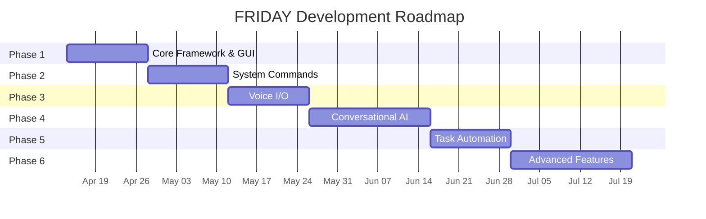

# FRIDAY — Development Phases & Roadmap

> A phased plan for building FRIDAY incrementally, with each phase producing a **working, testable milestone**.

---

## Phase 1 — Core Framework & GUI Shell

> **Goal**: A working desktop app with a chat interface, plugin system, and command routing. Type a command → get a response.

### Tasks

| # | Task | Details |
|---|------|---------|
| 1.1 | Project scaffolding | Create folder structure, `requirements.txt`, `main.py` |
| 1.2 | Config manager | Load/save `config.yaml`, per-module settings |
| 1.3 | Logger | Structured logging (file + console) |
| 1.4 | Event bus | Simple publish/subscribe for inter-module communication |
| 1.5 | Plugin manager | Auto-discover and load modules from `modules/` folder |
| 1.6 | Command router | Parse text input → match to a registered module handler |
| 1.7 | PyQt5 main window | Window with title bar, layout, dark theme |
| 1.8 | Chat widget | Scrollable chat with user & assistant message bubbles |
| 1.9 | Input bar | Text input + send button |
| 1.10 | Dark theme QSS | Sci-fi / cyberpunk styling |
| 1.11 | System tray | Minimize to tray icon with quick actions |

### Deliverable
- Launch app → type "hello" → get a response in chat
- Type "help" → see list of available commands
- Plugin system loads a sample "greeter" module

### Dependencies
- `PyQt5`

### Estimated Time: 1-2 weeks

---

## Phase 2 — System Commands

> **Goal**: Control the laptop via text commands — open apps, check battery, search files.

### Tasks

| # | Task | Details |
|---|------|---------|
| 2.1 | App launcher | Open applications by name, cross-platform (Linux/Windows) |
| 2.2 | System info | CPU, RAM, battery, disk usage via `psutil` |
| 2.3 | File search | Search files by name/extension using `os.walk` or `pathlib` |
| 2.4 | Volume control | Platform-specific volume get/set |
| 2.5 | Brightness control | Platform-specific brightness adjustment |
| 2.6 | Screenshot | Capture full screen, save to folder |
| 2.7 | Platform abstraction | OS detection layer — same commands work on Linux & Windows |

### Deliverable
- "Open Firefox" → launches Firefox
- "Battery status" → shows battery percentage in chat
- "Find files named report" → lists matching files

### Dependencies
- `psutil`, `pyautogui`, `Pillow`
- Phase 1 complete

### Estimated Time: 1-2 weeks

---

## Phase 3 — Voice Input & Output

> **Goal**: Talk to FRIDAY and hear responses. Optional wake-word activation.

### Tasks

| # | Task | Details |
|---|------|---------|
| 3.1 | Vosk STT integration | Continuous mic listening → text using Vosk small model |
| 3.2 | pyttsx3 TTS integration | Speak responses aloud |
| 3.3 | Mic toggle in GUI | Button to start/stop listening + visual indicator |
| 3.4 | Wake word detection | "Hey Friday" keyword triggers active listening |
| 3.5 | Audio feedback | Beep/sound on wake word detection |
| 3.6 | Settings UI | Choose mic device, TTS voice/speed |

### Deliverable
- Say "Hey Friday, what's my battery status?" → hear spoken response
- Mic button in GUI toggles listening
- All voice processing is offline

### Key Notes
- Vosk small English model is ~50MB, very fast on CPU
- pyttsx3 uses OS-native speech engines (eSpeak on Linux, SAPI5 on Windows)
- Later upgrade path: swap pyttsx3 for Piper TTS for better voice quality

### Dependencies
- `vosk`, `sounddevice`, `pyttsx3`
- Phase 1 complete (Phase 2 optional but recommended)

### Estimated Time: 1-2 weeks

---

## Phase 4 — Conversational AI (Local LLM)

> **Goal**: Natural language conversations powered by a small local language model.

### Tasks

| # | Task | Details |
|---|------|---------|
| 4.1 | llama-cpp-python setup | Install and configure for CPU inference |
| 4.2 | Model download script | Download TinyLlama 1.1B GGUF (Q4_K_M, ~700MB) |
| 4.3 | Chat completion wrapper | Session-based conversation with context |
| 4.4 | FRIDAY persona prompt | System prompt giving FRIDAY's personality |
| 4.5 | Intent extraction | LLM detects when user wants a system command vs. chat |
| 4.6 | Lazy loading | Load LLM only when needed, unload to free RAM |
| 4.7 | Streaming responses | Show tokens as they generate in chat widget |

### Deliverable
- "Tell me a joke" → LLM generates a response in FRIDAY's persona
- "Open Terminal" → LLM extracts intent, routes to system module
- Response streams token-by-token in chat

### Performance Expectations

| Model | Size | RAM Usage | Speed (approx.) |
|-------|------|-----------|------------------|
| TinyLlama 1.1B Q4_K_M | ~700MB | ~1.5GB | 10-15 tok/s |
| Phi-2 2.7B Q4_K_M | ~1.8GB | ~3GB | 5-8 tok/s |

### Dependencies
- `llama-cpp-python`
- Phase 1 complete

### Estimated Time: 2-3 weeks

---

## Phase 5 — Task Automation & Productivity

> **Goal**: Reminders, notes, clipboard history, scheduled tasks.

### Tasks

| # | Task | Details |
|---|------|---------|
| 5.1 | Reminder system | "Remind me in 30 min to take a break" → notification |
| 5.2 | Quick notes | Save/list/search text notes in SQLite |
| 5.3 | Clipboard manager | Track clipboard history, paste previous items |
| 5.4 | Scheduled commands | Run any command at a scheduled time |
| 5.5 | Notification system | Desktop notifications for reminders/alerts |

### Deliverable
- "Remind me to drink water in 20 minutes" → notification fires
- "Save note: meeting at 3pm" → stored and retrievable
- "Show clipboard history" → last 10 copied items

### Dependencies
- `APScheduler`, `plyer` (notifications)
- Phase 1 complete, Phase 4 recommended

### Estimated Time: 1-2 weeks

---

## Phase 6 — Advanced Features

> **Goal**: Power-user features — window management, media control, custom macros.

### Tasks

| # | Task | Details |
|---|------|---------|
| 6.1 | Window manager | List/move/resize/close windows via `wmctrl`/Win32API |
| 6.2 | Media playback control | Play/pause/next/previous for active media player |
| 6.3 | Custom macros | User-defined command sequences ("morning routine") |
| 6.4 | Command history | Browse and re-run past commands |
| 6.5 | Usage analytics | Local stats — most used commands, usage patterns |

### Deliverable
- "Close all Firefox windows" → closes them
- "Run my morning routine" → executes saved macro
- "What did I ask yesterday?" → shows command history

### Dependencies
- All previous phases
- Platform-specific tools (`wmctrl` on Linux, `pywin32` on Windows)

### Estimated Time: 2-3 weeks

---

## Summary Timeline



## Testing Strategy (All Phases)

| Type | Approach |
|---|---|
| **Unit Tests** | `pytest` for core logic (router, config, plugins, event bus) |
| **Integration Tests** | Module-to-module tests via event bus |
| **Manual Testing** | Run the app, try commands, verify behavior |
| **Cross-Platform** | Test on both Linux and Windows after each phase |

---

## Quick Reference: All Dependencies

```
# Core (Phase 1)
PyQt5

# System (Phase 2)
psutil
pyautogui
Pillow

# Voice (Phase 3)
vosk
sounddevice
pyttsx3

# LLM (Phase 4)
llama-cpp-python

# Automation (Phase 5)
APScheduler
plyer

# Advanced (Phase 6)
pywin32           # Windows only
# wmctrl          # Linux only (system package)
```
