# FRIDAY v2 — Architecture Redesign Document

> **Version:** 2.0 · **Date:** 2026-05-01 · **Status:** Proposed Design
>
> This document audits the current FRIDAY architecture against the real codebase,
> confirms which problems are genuine, corrects inaccuracies in the original analysis,
> and proposes a concrete v2 architecture with diagrams, interface contracts, and a
> phased migration plan.

---

## Table of Contents

1. [Current Architecture Audit](#1-current-architecture-audit)
2. [Confirmed Problems — Evidence-Based](#2-confirmed-problems--evidence-based)
3. [What Is Already Working Well](#3-what-is-already-working-well)
4. [Problem Severity Matrix](#4-problem-severity-matrix)
5. [FRIDAY v2 Design Goals](#5-friday-v2-design-goals)
6. [v2 Layer Overview](#6-v2-layer-overview)
7. [RuntimeKernel — Replacing FridayApp](#7-runtimekernel--replacing-fridayapp)
8. [TurnOrchestrator — Single Control Flow](#8-turnorchestrator--single-control-flow)
9. [Planning System — IntentEngine + PlannerEngine](#9-planning-system--intentengine--plannerengine)
10. [TaskGraphExecutor — Parallel Execution](#10-taskgraphexecutor--parallel-execution)
11. [Concurrency Model](#11-concurrency-model)
12. [MemoryService — Unified Memory Facade](#12-memoryservice--unified-memory-facade)
13. [State Management — TurnContext + SessionStore](#13-state-management--turncontext--sessionstore)
14. [Observability — Tracing and Metrics](#14-observability--tracing-and-metrics)
15. [Capability and Plugin System](#15-capability-and-plugin-system)
16. [Component Interface Contracts](#16-component-interface-contracts)
17. [Migration Roadmap](#17-migration-roadmap)
18. [What Stays, What Changes, What Goes](#18-what-stays-what-changes-what-goes)

---

## 1. Current Architecture Audit

The original redesign document listed seven problems. Cross-checking each against the
actual codebase documented in `architecture.md`:

### 1.1 Finding Accuracy Summary

| # | Finding | Verdict | Accuracy Note |
|---|---------|---------|---------------|
| 3.1 | God Object (`FridayApp`) | ✅ Confirmed | 24 services wired manually in `__init__`; doc says "no DI framework" |
| 3.2 | Multiple competing control flows | ✅ Confirmed | 5 distinct execution paths documented |
| 3.3 | Routing logic fragmentation | ✅ Confirmed | 4 separate components in routing chain; "duplicate logic" overstates it — they are distinct but fragmented |
| 3.4 | Tight coupling between layers | ⚠️ Partially correct | Real, but the example "agents calling router" is wrong; actual coupling is `CapabilityBroker → WorkflowOrchestrator` and modules holding `app` back-references |
| 3.5 | Stateful complexity spread | ✅ Confirmed | **7** state locations identified (not the 4 listed) |
| 3.6 | Latency bottlenecks | ⚠️ Mostly correct | `OrderedToolExecutor` is sequential; however Qwen already runs with 2500ms ThreadPoolExecutor timeout and ResearchAgent already uses `ThreadPoolExecutor(max_workers=3)` |
| 3.7 | Partial dependency injection | ✅ Confirmed | `bootstrap/container.py` exists but `FridayApp.__init__` explicitly bypasses it |

### 1.2 Missed Problems (Not in Original Document)

These real problems were not captured:

**M1 — Inference Lock Contention**
`chat_inference_lock` and `tool_inference_lock` are shared RLocks. The research agent's
background threads can hold `tool_inference_lock` for 45 seconds, starving Tier 2 routing
(Qwen) on the main turn thread. Two unrelated subsystems compete on the same lock.

**M2 — SpeechCoordinator Dedup is Turn-ID Scoped**
`SpeechCoordinator` tracks `SpeechTurnState` keyed by `turn_id`. If a barge-in arrives
before the daemon thread is cancelled, two turns can be active simultaneously. The dedup
set (`spoken_texts`) is only per-turn, not global, so duplicate speech can escape during
the cancellation window.

**M3 — ExtensionContext Back-Reference to App**
`ExtensionLoader` passes `ExtensionContext` to every module. `ExtensionContext` holds a
reference back to `FridayApp`. This means every loaded module has a path to the god
object, effectively negating the isolation the protocol was meant to provide.

**M4 — ContextStore Has No Abstraction Boundary**
12 different modules access `app.context_store` directly (confirmed by grep). Any schema
migration in `ContextStore` is a multi-file change with no contract enforcement.

**M5 — No Backpressure on the EventBus**
`EventBus.publish()` is synchronous. A slow TTS handler blocks all subsequent subscribers
for that topic on the same thread. There is no timeout, queue, or priority mechanism.

---

## 2. Confirmed Problems — Evidence-Based

### 2.1 God Object (`FridayApp`)

`FridayApp.__init__` wires 24 services in explicit ordered sequence:

```
ConfigManager → EventBus → SessionID → LocalModelManager → ContextStore →
FridaySettings → RoutingState → DialogState → CommandRouter → IntentRecognizer →
CapabilityRegistry → CapabilityBroker → AssistantContext → MemoryBroker →
PersonaManager → WorkflowOrchestrator → ConversationAgent → TurnManager →
SpeechCoordinator → TaskRunner → TextToSpeech → STTEngine → WakeWordDetector →
ExtensionLoader → LifecycleManager.start_all()
```

`architecture.md §4` explicitly states: *"There is no runtime dependency injection
framework — every attribute is set in `__init__` in explicit wiring order."*

**Consequence:** Adding a new service requires modifying `FridayApp.__init__`,
understanding the 24-step wiring order, and re-running the full integration test suite.

### 2.2 Multiple Competing Control Flows

Five distinct paths from user input to tool execution:

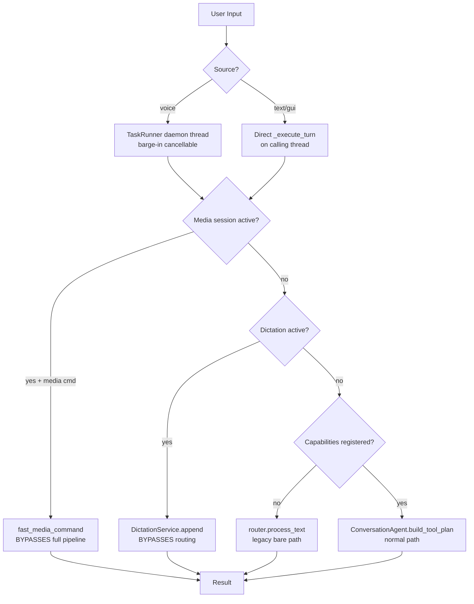

Each path skips different layers. Tracing a turn requires knowing which of 5 paths was
active.

### 2.3 Routing Logic Fragmentation

A single turn potentially touches all four routing components:

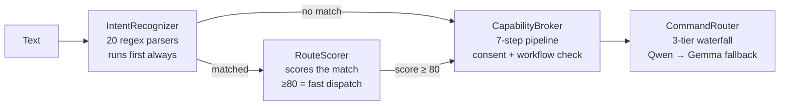

Each component was added at a different time to solve a specific problem, leading to
overlapping responsibilities. `CapabilityBroker` both checks for active workflows AND
calls `IntentRecognizer` again internally via its action plan check.

### 2.4 Tight Coupling (Corrected)

The original finding said "agents calling router again". The real couplings are:

| Coupling | Location | Problem |
|----------|----------|---------|
| `CapabilityBroker` calls `WorkflowOrchestrator.continue_active()` | `capability_broker.py` | Broker should not know about workflows |
| `ExtensionContext` holds `app` reference | `extensions/protocol.py` | Every module has a back-door to the god object |
| `ConversationAgent` → `CapabilityBroker` → `WorkflowOrchestrator` → `ExtensionLoader` → modules → `app` | Full chain | 5-hop reference chain |
| `ExtensionContext.register_capability()` writes to both `CapabilityRegistry` AND `CommandRouter` simultaneously | `extensions/protocol.py` | Dual-write, hidden coupling |

### 2.5 Stateful Complexity Spread (Extended)

Seven separate state locations, not the four listed in the original document:

| Location | Lifecycle | Scope | Risk |
|----------|-----------|-------|------|
| `RoutingState` | Per-turn, ephemeral | Turn | `voice_already_spoken` flag can desync |
| `DialogState` | Per-turn, ephemeral | Turn | Pending file requests drift on cancellation |
| `SpeechCoordinator.SpeechTurnState` | Per-turn, ephemeral | Turn | Barge-in race during cancellation window |
| `AssistantContext` rolling window | Per-session, in-memory | Session | Lost on crash, 16-turn limit |
| `ContextStore.workflow_states` | Persistent, SQLite | Session | No TTL, stale workflows survive restarts |
| `ProceduralMemory._rates` | Persistent, via SQLite | Global | Written lazily, lost on hard crash |
| `BrowserMediaService` session state | Per-service, in-memory | Global | Not cleared on `shutdown()` |

### 2.6 Latency Bottlenecks (Clarified)

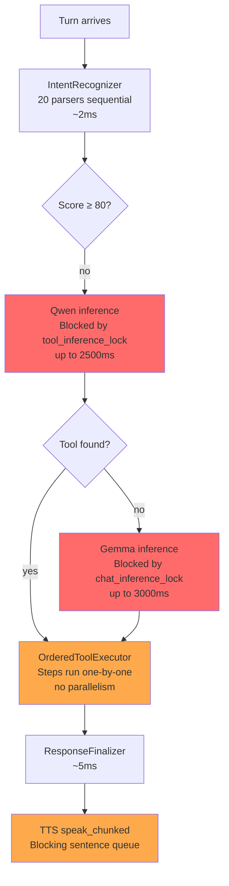

**Already parallelised (good):**
- Qwen tool selection: `ThreadPoolExecutor` with 2500ms timeout
- Research fetching: `ThreadPoolExecutor(max_workers=3)`

**Still sequential (bad):**
- Multi-step tool plans: `OrderedToolExecutor` runs step-by-step even for independent tools
- All 20 `IntentRecognizer` parsers run even when the first one matches
- `BrowserMediaService` jobs are serialised through a single worker thread queue

---

## 3. What Is Already Working Well

Before redesigning, it is important to record what should be preserved:

| Component | Strength | Keep in v2? |
|-----------|---------|-------------|
| Three-tier routing concept | Deterministic fast path avoids LLM for simple commands | ✅ Yes |
| `CapabilityDescriptor` schema | Rich metadata (connectivity, permission, latency class) | ✅ Yes |
| `ResultCache` with TTL | Avoids redundant LLM/API calls | ✅ Yes |
| `SpeechCoordinator` dedup | Prevents double-speaking within a turn | ✅ Yes |
| `EpisodicMemory` + `SemanticMemory` + `ProceduralMemory` | Three-tier memory is well-designed | ✅ Yes (via facade) |
| `ExtensionLoader` + `Extension` protocol | Clean plugin loading with 3-tier fallback | ✅ Yes (extended) |
| Tracing via `contextvars` | Zero-overhead trace propagation | ✅ Yes |
| `WorkflowOrchestrator` pattern | State-machine workflows are the right model | ✅ Yes (promoted) |
| `ConsentService` / `PermissionTier` | Correct model for online gating | ✅ Yes |
| `RotatingFileHandler` + `_TraceContextFilter` | Trace-tagged logs are invaluable | ✅ Yes |

---

## 4. Problem Severity Matrix

| Problem | User-visible Impact | Developer Impact | Priority |
|---------|-------------------|-----------------|---------|
| God Object (`FridayApp`) | None directly | High — every new feature requires `__init__` surgery | High |
| Competing control flows | Occasional missed turns during media/dictation | High — bugs in one path silently affect others | High |
| Inference lock contention | Research blocks voice routing for up to 45s | Medium | High |
| Routing fragmentation | Inconsistent routing for edge-case utterances | High — bugs are hard to reproduce | Medium |
| Sequential tool execution | Slow multi-step responses | Medium | Medium |
| State spread | Stale workflow state after crash/restart | Medium | Medium |
| Tight coupling (ExtensionContext → app) | None directly | Medium — hard to unit-test extensions in isolation | Medium |
| No EventBus backpressure | TTS slowness blocks other subscribers | Low (rare) | Low |
| Partial DI | None directly | Low — cosmetic, workaround is `app.*` access | Low |

---

## 5. FRIDAY v2 Design Goals

1. **Single turn entry point.** One class, one method, one code path from input to response.
2. **Separated inference locks.** Research summarisation and conversational routing must not compete on the same lock.
3. **Parallel tool execution.** Independent tools in a multi-step plan run concurrently.
4. **Isolated extensions.** Extensions receive a `CapabilityContext` that does not expose the god object.
5. **Unified state.** All per-turn ephemeral state in one `TurnContext`; all persistent state behind `SessionStore`.
6. **Memory behind a facade.** No module touches `ContextStore` directly; all access via `MemoryService`.
7. **Observable by default.** Every turn produces a structured `TurnTrace` with timing, routing decision, and outcome.
8. **Incremental migration.** v2 components must be addable alongside v1 without a rewrite; the system must stay runnable at every phase.

---

## 6. v2 Layer Overview

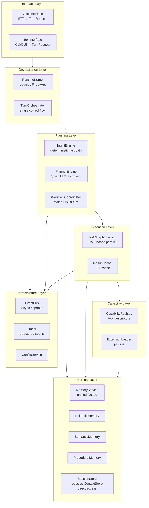

**Key rule:** Arrows only point downward. No upward references. Extensions in the Capability
Layer receive a `CapabilityContext` that exposes only Memory, Events, Config, and Consent —
not the RuntimeKernel.

---

## 7. RuntimeKernel — Replacing FridayApp

`RuntimeKernel` is a thin bootstrap shell. It does not wire services manually. It owns
`ServiceContainer` which resolves dependencies lazily via registered factories.

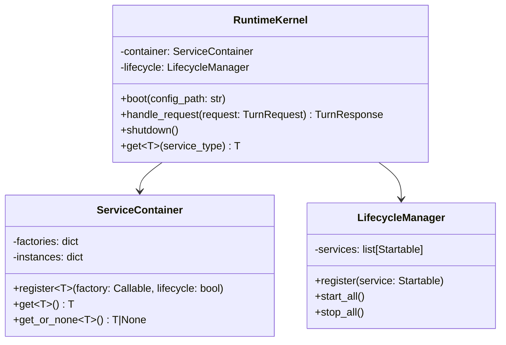

### Registration replaces wiring order

```python
# core/bootstrap/kernel.py  — replaces FridayApp.__init__

def boot(config_path: str) -> RuntimeKernel:
    c = ServiceContainer()

    # Infrastructure
    c.register(ConfigService,  lambda: ConfigService(config_path))
    c.register(EventBus,       lambda: EventBus())
    c.register(Tracer,         lambda: Tracer(c.get(ConfigService)))

    # Persistence
    c.register(SessionStore,   lambda: SessionStore(c.get(ConfigService)))

    # Memory
    c.register(EpisodicMemory, lambda: EpisodicMemory(c.get(SessionStore)))
    c.register(SemanticMemory, lambda: SemanticMemory(c.get(SessionStore)))
    c.register(ProceduralMemory, lambda: ProceduralMemory(c.get(SessionStore)))
    c.register(MemoryService,  lambda: MemoryService(
        c.get(EpisodicMemory), c.get(SemanticMemory), c.get(ProceduralMemory)
    ))

    # Models — two SEPARATE lock domains
    c.register(ChatModel,  lambda: ChatModel(c.get(ConfigService)),  lifecycle=True)
    c.register(ToolModel,  lambda: ToolModel(c.get(ConfigService)),  lifecycle=True)

    # Planning
    c.register(CapabilityRegistry, lambda: CapabilityRegistry())
    c.register(IntentEngine,   lambda: IntentEngine(c.get(CapabilityRegistry)))
    c.register(PlannerEngine,  lambda: PlannerEngine(
        c.get(ToolModel), c.get(ChatModel), c.get(ConsentGate)
    ))
    c.register(WorkflowCoordinator, lambda: WorkflowCoordinator(
        c.get(SessionStore), c.get(MemoryService)
    ))

    # Execution
    c.register(ResultCache,     lambda: ResultCache())
    c.register(TaskGraphExecutor, lambda: TaskGraphExecutor(
        c.get(CapabilityRegistry), c.get(ResultCache)
    ))

    # Orchestration
    c.register(TurnOrchestrator, lambda: TurnOrchestrator(
        c.get(IntentEngine), c.get(PlannerEngine),
        c.get(WorkflowCoordinator), c.get(TaskGraphExecutor),
        c.get(MemoryService), c.get(EventBus), c.get(Tracer)
    ))

    # Voice / Speech
    c.register(TextToSpeech, lambda: TextToSpeech(c.get(ConfigService)), lifecycle=True)
    c.register(STTEngine,    lambda: STTEngine(c.get(ConfigService)),    lifecycle=True)

    # Extensions
    c.register(ExtensionLoader, lambda: ExtensionLoader(
        c.get(CapabilityRegistry), c.get(EventBus),
        c.get(ConsentGate), c.get(MemoryService), c.get(ConfigService)
        # NOTE: no kernel reference passed
    ), lifecycle=True)

    kernel = RuntimeKernel(c)
    kernel._lifecycle.start_all()
    return kernel
```

Every service is resolved lazily. Adding a new service means adding one `c.register()` line.
`FridayApp` is removed.

---

## 8. TurnOrchestrator — Single Control Flow

All five competing paths collapse into one:

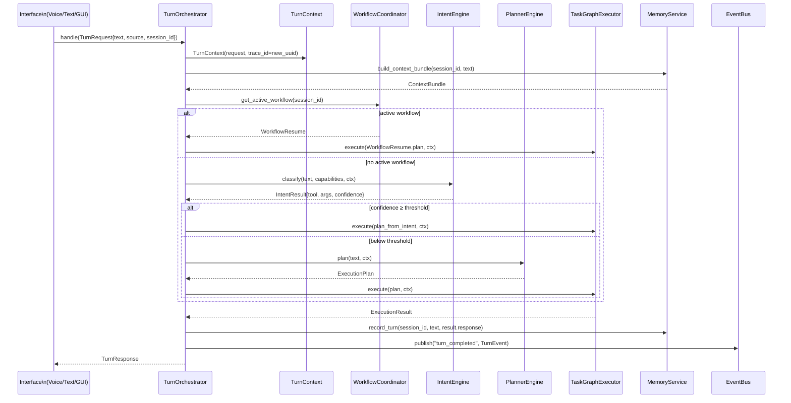

### TurnRequest and TurnResponse

```python
@dataclass
class TurnRequest:
    text: str
    source: Literal["voice", "text", "gui"]
    session_id: str
    timestamp: float = field(default_factory=time.time)

@dataclass
class TurnResponse:
    response: str
    spoken_ack: str | None
    source: str           # routing source: "intent", "planner", "workflow", "chat"
    trace_id: str
    duration_ms: float
```

### What each interface sends

| Interface | Path in v1 | Path in v2 |
|-----------|-----------|-----------|
| Voice (STT) | `TaskRunner` daemon + 5-path split | `TurnOrchestrator.handle()` via `asyncio.create_task()` |
| CLI | `_execute_turn` direct | `TurnOrchestrator.handle()` awaited |
| GUI | `_execute_turn` direct | `TurnOrchestrator.handle()` awaited |
| Fast media | Hard-coded bypass in `_execute_turn` | `IntentEngine` matches → `media_control` tool dispatched at 0 LLM cost |
| Dictation | Early-exit in `STTEngine` | `IntentEngine` matches → `DictationTool.append()` |

---

## 9. Planning System — IntentEngine + PlannerEngine

Merging `IntentRecognizer`, `RouteScorer`, and `CapabilityBroker` into two components with clear contracts.

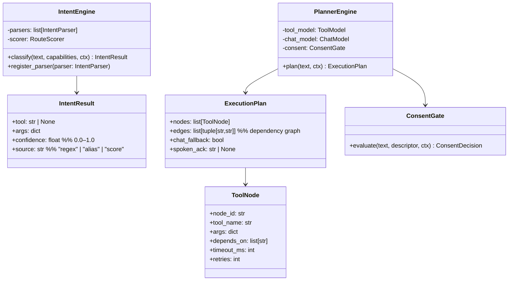

### How they differ from current components

| Concern | v1 | v2 |
|---------|----|----|
| Regex matching | `IntentRecognizer._parse_*` methods | `IntentEngine` parser plugins (same logic, pluggable) |
| Scoring | `RouteScorer` (separate class) | `IntentEngine` internal scorer — still deterministic |
| Consent check | `CapabilityBroker` step 1 | `ConsentGate` called by `PlannerEngine` only |
| Workflow check | `CapabilityBroker` step 2 | `WorkflowCoordinator` queried by `TurnOrchestrator` before planning |
| LLM tool selection | `CommandRouter` (Tier 2) | `PlannerEngine.plan()` |
| Chat fallback | `CommandRouter` (Tier 3) | `PlannerEngine` sets `plan.chat_fallback = True` |

### IntentEngine short-circuit

Parsers are ordered by expected hit frequency. As soon as one parser returns
`confidence ≥ HIGH_THRESHOLD (0.9)`, the remaining parsers are skipped:

```python
def classify(self, text, capabilities, ctx) -> IntentResult:
    for parser in self._parsers:          # ordered by frequency
        result = parser.parse(text, capabilities, ctx)
        if result and result.confidence >= HIGH_THRESHOLD:
            return result                 # short-circuit — no further parsers
    # fall through to scorer
    return self._scorer.score(text, capabilities)
```

This eliminates the current behaviour where all 20 parsers always run.

---

## 10. TaskGraphExecutor — Parallel Execution

Replaces `OrderedToolExecutor` with a dependency-aware parallel runner.

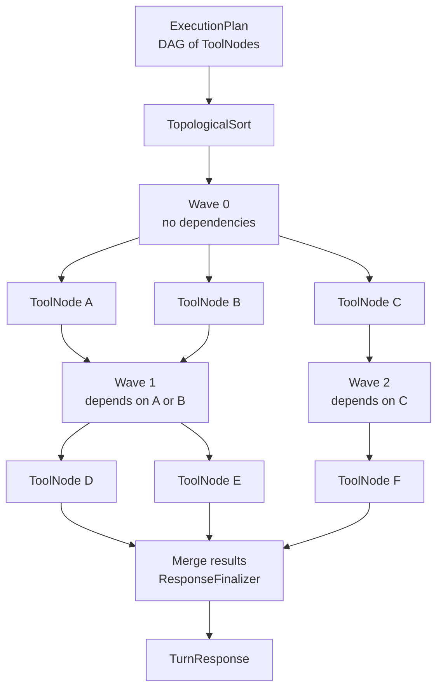

### Execution algorithm

```python
async def execute(self, plan: ExecutionPlan, ctx: TurnContext) -> ExecutionResult:
    results: dict[str, str] = {}
    waves = topological_waves(plan.nodes, plan.edges)

    for wave in waves:
        tasks = [
            self._run_node(node, ctx, results)
            for node in wave
        ]
        wave_results = await asyncio.gather(*tasks, return_exceptions=True)
        for node, result in zip(wave, wave_results):
            if isinstance(result, Exception):
                ctx.tracer.record_error(node.node_id, result)
                results[node.node_id] = self._error_response(node, result)
            else:
                results[node.node_id] = result

    return ExecutionResult(results=results, ctx=ctx)

async def _run_node(self, node: ToolNode, ctx: TurnContext, prior: dict) -> str:
    descriptor = self._registry.get(node.tool_name)
    # Inject outputs of dependencies into args
    args = {**node.args, **{k: prior[k] for k in node.depends_on if k in prior}}

    cached = self._cache.get(descriptor.name, args, ctx.text)
    if cached:
        return cached

    for attempt in range(node.retries + 1):
        try:
            async with asyncio.timeout(node.timeout_ms / 1000):
                result = await asyncio.get_event_loop().run_in_executor(
                    None, descriptor.handler, ctx.text, args
                )
            self._cache.store(descriptor.name, args, ctx.text, result, descriptor)
            return result
        except TimeoutError:
            if attempt == node.retries:
                raise
```

### Benefits over `OrderedToolExecutor`

| Aspect | v1 (`OrderedToolExecutor`) | v2 (`TaskGraphExecutor`) |
|--------|--------------------------|--------------------------|
| Multi-step plans | Sequential always | Parallel where no dependency |
| Dependency injection | None (steps are isolated) | Prior node output injected into args |
| Timeout per tool | No | Yes (per `ToolNode.timeout_ms`) |
| Retry per tool | No | Yes (per `ToolNode.retries`) |
| Error handling | Exception aborts plan | Error recorded; independent nodes continue |
| Cache integration | External post-hoc | Inline per node |

---

## 11. Concurrency Model

### Separated lock domains

The critical fix for inference lock contention is splitting responsibilities:

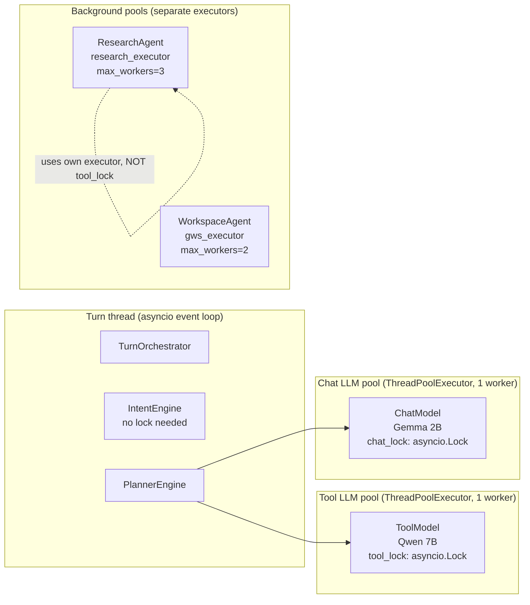

**Rule:** Research summarisation uses its own `ThreadPoolExecutor` and its own semaphore.
It never touches `tool_lock` or `chat_lock`. A 45-second research job can no longer block
a conversational turn.

### Async model

```python
# v2 concurrency: asyncio event loop + executor per LLM domain

class ToolModel:
    def __init__(self):
        self._executor = ThreadPoolExecutor(max_workers=1, thread_name_prefix="tool-llm")
        self._lock = asyncio.Lock()   # asyncio.Lock — non-blocking on the event loop

    async def infer(self, prompt: str, timeout_s: float = 2.5) -> str:
        async with self._lock:
            async with asyncio.timeout(timeout_s):
                return await asyncio.get_event_loop().run_in_executor(
                    self._executor, self._llm.create_chat_completion, [{"role":"user","content":prompt}]
                )

class ResearchSummarizer:
    _executor = ThreadPoolExecutor(max_workers=3, thread_name_prefix="research")
    _semaphore = asyncio.Semaphore(3)   # cap concurrent LLM calls from research

    async def summarize(self, text: str, topic: str) -> str:
        async with self._semaphore:
            # uses its own ChatModel instance or a dedicated summarizer model
            ...
```

### Turn cancellation

Voice barge-in uses `asyncio.Task.cancel()` rather than `threading.Event` + join:

```python
class TurnRunner:
    _current_task: asyncio.Task | None = None

    async def submit(self, request: TurnRequest):
        if self._current_task and not self._current_task.done():
            self._current_task.cancel()
            await asyncio.shield(self._tts.stop_async())
        self._current_task = asyncio.create_task(
            self._orchestrator.handle(request)
        )
```

---

## 12. MemoryService — Unified Memory Facade

All 12 modules that currently access `app.context_store` directly are redirected through
`MemoryService`. The underlying storage implementation (`ContextStore`, `ChromaDB`) is
hidden behind a stable interface.

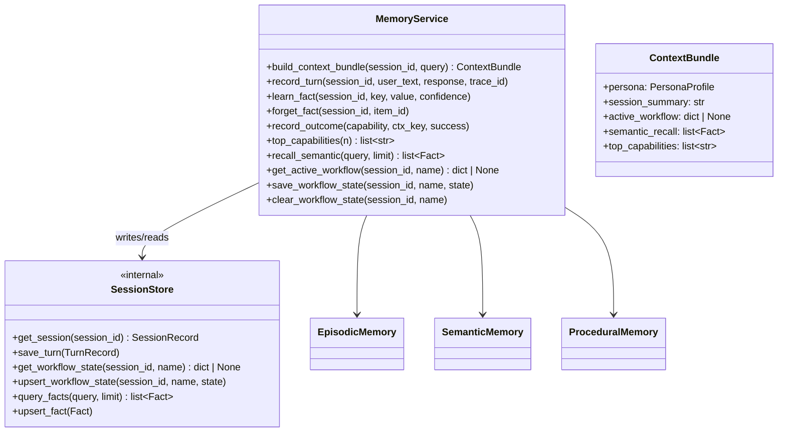

### What modules get instead of `app.context_store`

Extensions receive a `CapabilityContext` containing `MemoryService`. They call:
- `ctx.memory.learn_fact(session_id, "name", "Tricky", 0.95)`
- `ctx.memory.recall_semantic("user preferences", limit=3)`
- `ctx.memory.save_workflow_state(session_id, "calendar_event_workflow", state)`

They never call `ctx.memory._store.session_store.db.execute(...)`.

---

## 13. State Management — TurnContext + SessionStore

All seven scattered state locations collapse into two:

### TurnContext (ephemeral, one per turn)

```python
@dataclass
class TurnContext:
    # Identity
    turn_id: str
    session_id: str
    trace_id: str
    source: str

    # Input
    text: str
    timestamp: float

    # Planning output (filled during orchestration)
    intent_result: IntentResult | None = None
    execution_plan: ExecutionPlan | None = None

    # Execution output
    response: str | None = None
    voice_spoken: bool = False   # replaces RoutingState.voice_already_spoken

    # Pending state (replaces DialogState)
    pending_file_request: PendingFileRequest | None = None
    pending_confirmation: PendingConfirmation | None = None

    # Cancellation
    cancelled: bool = False

    # Observability
    tracer: TurnTracer = field(default_factory=TurnTracer)
    timings: dict[str, float] = field(default_factory=dict)
```

`SpeechCoordinator` references `TurnContext.turn_id` and `TurnContext.voice_spoken`
directly. There is no separate `SpeechTurnState` dict to get out of sync.

### SessionStore (persistent, replaces ContextStore direct access)

```python
class SessionStore:
    """Single persistent state owner. All writes go through here."""

    def upsert_workflow_state(self, session_id: str, name: str, state: dict) -> None:
        # SQLite upsert with updated_at timestamp
        # Enforces max_age TTL — stale workflows auto-expire after 24h

    def get_active_workflow(self, session_id: str, name: str | None = None) -> dict | None:
        # Returns None if state.updated_at > 24h ago (auto-expire)
        ...
```

The 24-hour TTL on workflow states prevents the current bug where stale
`calendar_event_workflow` state survives a FRIDAY restart.

---

## 14. Observability — Tracing and Metrics

### TurnTracer

Every turn produces a structured `TurnTrace`:

```python
@dataclass
class TurnTrace:
    turn_id: str
    session_id: str
    trace_id: str
    source: str
    text: str
    started_at: float

    # Routing
    routing_source: str | None = None   # "intent" | "planner" | "workflow" | "chat"
    intent_confidence: float | None = None
    tool_selected: str | None = None

    # Execution
    nodes_executed: list[str] = field(default_factory=list)
    nodes_failed: list[str] = field(default_factory=list)
    total_latency_ms: float | None = None

    # Per-phase timings
    timings: dict[str, float] = field(default_factory=dict)
    # e.g. {"intent_engine": 1.2, "planner_engine": 245.0, "tool_launch_app": 55.0}

    # Outcome
    response_length: int | None = None
    error: str | None = None
```

Exported to `data/traces.jsonl` (JSONL, one line per turn). Replaces the current
`tracing.py` export which captures less structured data.

### Metrics

```python
class TurnMetrics:
    """Lightweight in-process counter. No external dependency."""
    intent_hits: int = 0           # turns resolved by IntentEngine
    planner_hits: int = 0          # turns resolved by PlannerEngine
    workflow_hits: int = 0         # turns resolved by WorkflowCoordinator
    chat_fallbacks: int = 0        # turns falling to Gemma chat
    tool_timeouts: int = 0         # individual tool node timeouts
    avg_latency_ms: float = 0.0
    p95_latency_ms: float = 0.0
```

Exposed via `get_friday_status` capability so the user can query "FRIDAY status" and see
routing efficiency.

---

## 15. Capability and Plugin System

### CapabilityContext (replaces ExtensionContext back-reference)

Extensions no longer receive an `app` reference. They receive a narrowly-scoped context:

```python
@dataclass
class CapabilityContext:
    session_id: str
    memory: MemoryService       # read/write memory
    events: EventBus            # publish events
    consent: ConsentGate        # check permissions
    config: ConfigService       # read config values
    # NOT: kernel, orchestrator, models, context_store, router
```

### ToolNode dependency declaration

Extensions declare inter-tool dependencies at registration time:

```python
ctx.register_capability(
    spec={
        "name": "create_calendar_event",
        "depends_on": [],           # no dependencies
        "timeout_ms": 8000,
        "retries": 1,
    },
    handler=self._handle_create_event,
    metadata=_WRITE_META,
)
```

When a multi-step plan includes `create_calendar_event` alongside `check_unread_emails`,
`TaskGraphExecutor` runs them in parallel (no declared dependency between them).

### Plugin isolation improvement

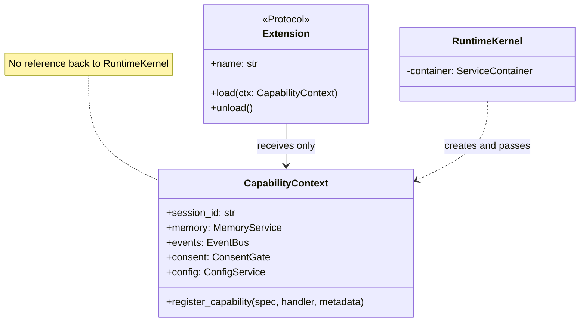

---

## 16. Component Interface Contracts

These are the stable interfaces that must not be violated across layers.

```python
# Planning Layer → Execution Layer
class Planner(Protocol):
    def classify(self, text: str, ctx: TurnContext) -> IntentResult: ...
    def plan(self, text: str, ctx: TurnContext) -> ExecutionPlan: ...

# Execution Layer → Capability Layer
class Executor(Protocol):
    async def execute(self, plan: ExecutionPlan, ctx: TurnContext) -> ExecutionResult: ...

# Memory Layer public interface
class IMemoryService(Protocol):
    def build_context_bundle(self, session_id: str, query: str) -> ContextBundle: ...
    def record_turn(self, session_id: str, user: str, assistant: str, trace_id: str): ...
    def learn_fact(self, session_id: str, key: str, value: str, confidence: float): ...
    def get_active_workflow(self, session_id: str, name: str) -> dict | None: ...
    def save_workflow_state(self, session_id: str, name: str, state: dict): ...
    def clear_workflow_state(self, session_id: str, name: str): ...

# Extension context — what extensions may use
class ICapabilityContext(Protocol):
    session_id: str
    memory: IMemoryService
    events: EventBus
    consent: ConsentGate
    config: ConfigService
    def register_capability(self, spec: dict, handler: Callable, metadata: dict): ...
```

---

## 17. Migration Roadmap

Migration is incremental. At every phase the system must remain runnable.

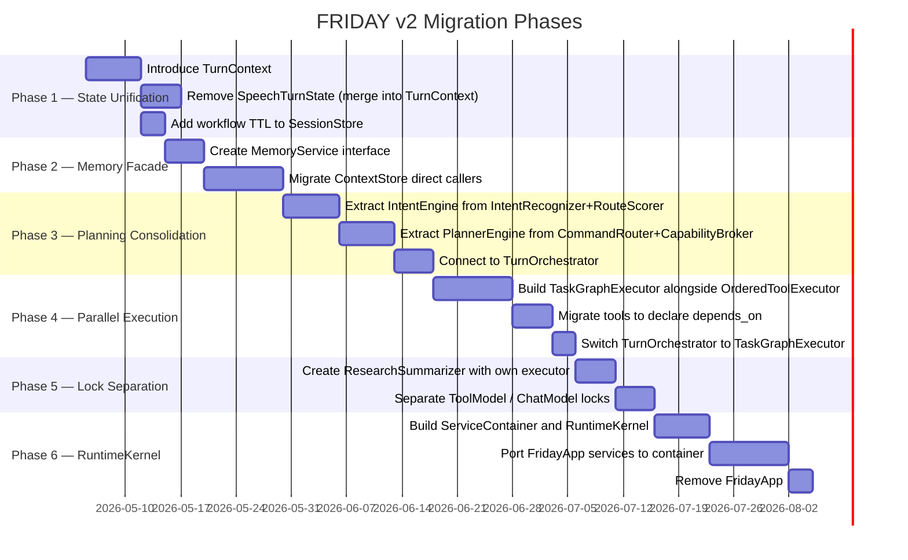

### Phase detail

**Phase 1 — State Unification** (lowest risk, immediate benefit)
- Introduce `TurnContext` as a wrapper passed through existing components.
- Merge `RoutingState.voice_already_spoken` into `TurnContext.voice_spoken`.
- Merge `DialogState` pending fields into `TurnContext.pending_*`.
- Add 24-hour TTL to `ContextStore.workflow_states` to fix stale state bug.
- No external behaviour change. Existing tests continue to pass.

**Phase 2 — Memory Facade** (medium risk)
- Create `MemoryService` as a thin wrapper around `ContextStore` calls.
- Migrate the 12 direct `app.context_store` callers one at a time.
- Keep `ContextStore` intact — `MemoryService` delegates to it internally.

**Phase 3 — Planning Consolidation** (medium risk, biggest architectural change)
- Create `IntentEngine` wrapping `IntentRecognizer`'s parsers + `RouteScorer`. Same logic, new home.
- Create `PlannerEngine` wrapping `CommandRouter`'s Qwen + Gemma path.
- Introduce `TurnOrchestrator` with the single-flow sequence diagram from §8.
- Run both old and new paths in parallel with assertion checks for one sprint before cutting over.

**Phase 4 — Parallel Execution** (medium risk, significant performance gain)
- Implement `TaskGraphExecutor` alongside `OrderedToolExecutor`.
- Register all existing tools with `depends_on=[]` (safe default — all independent).
- Add `depends_on` declarations only where actual data dependencies exist.
- Cut over `TurnOrchestrator` to use `TaskGraphExecutor`.

**Phase 5 — Lock Separation** (low risk, fixes inference contention)
- Move `ResearchAgentService` summarisation to its own `ThreadPoolExecutor` + `asyncio.Semaphore`.
- Give `ToolModel` and `ChatModel` their own `asyncio.Lock` instances (not shared RLock).
- Test: research running concurrently with a voice turn must not increase turn latency.

**Phase 6 — RuntimeKernel** (highest effort, cosmetic once phases 1–5 are done)
- Build `ServiceContainer` and `RuntimeKernel.boot()`.
- Port services one by one from `FridayApp.__init__` to container registrations.
- Remove `FridayApp` once all 24 services are ported.
- `main.py` changes from `app = FridayApp(...)` to `kernel = RuntimeKernel.boot(...)`.

---

## 18. What Stays, What Changes, What Goes

| Component | v1 status | v2 action |
|-----------|-----------|-----------|
| `EventBus` | Synchronous pub/sub | ✅ Keep — add optional async publish for slow handlers |
| `CapabilityDescriptor` | Rich metadata schema | ✅ Keep — add `depends_on`, `timeout_ms`, `retries` fields |
| `ResultCache` | TTL cache | ✅ Keep unchanged |
| `EpisodicMemory` / `SemanticMemory` / `ProceduralMemory` | Three-tier memory | ✅ Keep — hidden behind `MemoryService` |
| `ExtensionLoader` + `Extension` protocol | Plugin loading | ✅ Keep — `ExtensionContext` → `CapabilityContext` (remove `app` ref) |
| `ConsentService` | Permission gating | ✅ Keep — renamed `ConsentGate` |
| `Tracer` + `_TraceContextFilter` | Trace ID propagation | ✅ Keep — extend with `TurnTrace` struct |
| `WorkflowOrchestrator` workflows | State machine multi-turn | ✅ Keep patterns — promoted to `WorkflowCoordinator` |
| `ResponseFinalizer` | Humanise + clarification | ✅ Keep — called at end of `TaskGraphExecutor.execute()` |
| `FridayApp` | God object, 24-service wiring | ❌ Remove — replaced by `RuntimeKernel` + `ServiceContainer` |
| `OrderedToolExecutor` | Sequential tool execution | ❌ Remove — replaced by `TaskGraphExecutor` |
| `CommandRouter` | 3-tier waterfall with routing and LLM | ♻️ Split — routing → `IntentEngine`, LLM → `PlannerEngine` |
| `CapabilityBroker` | 7-step mixed-concern pipeline | ♻️ Split — workflow check → `WorkflowCoordinator`, consent → `ConsentGate`, planning → `PlannerEngine` |
| `IntentRecognizer` | 20 parsers, monolithic | ♻️ Refactor — parsers become `IntentParser` plugins registered into `IntentEngine` |
| `RoutingState` | Per-turn flag bag | ♻️ Merge into `TurnContext` |
| `DialogState` | Pending request state | ♻️ Merge into `TurnContext` |
| `ContextStore` | Direct-access storage | ♻️ Keep as internal impl — hidden behind `SessionStore` + `MemoryService` |
| `chat_inference_lock` / `tool_inference_lock` shared RLocks | Cross-subsystem lock sharing | ♻️ Replace — each LLM domain owns its own `asyncio.Lock` |
| `TaskRunner` daemon threads | Barge-in cancellation | ♻️ Replace — `asyncio.Task.cancel()` |
| `SpeechCoordinator.SpeechTurnState` | Per-turn speech dedup | ♻️ Merge dedup logic into `TurnContext` |

---

## 9. Conclusion

All seven original findings are structurally valid. Five additional problems were identified
through codebase cross-referencing that were not in the original document: inference lock
contention, barge-in race in speech coordination, extension back-references to the god
object, unabstracted `ContextStore` access spread across 12 modules, and synchronous
EventBus blocking.

The v2 architecture is not a rewrite. Every phase is addable alongside the current code.
The highest-value changes in order are:

1. **Inference lock separation** (Phase 5) — eliminates the 45-second research-blocks-routing bug.
2. **State unification into TurnContext** (Phase 1) — removes the barge-in race and stale workflow bugs.
3. **Parallel tool execution** (Phase 4) — measurable latency improvement for multi-step plans.
4. **Single control flow** (Phase 3) — eliminates the 5-path routing confusion.
5. **MemoryService facade** (Phase 2) — enables safe schema evolution.
6. **RuntimeKernel** (Phase 6) — cosmetic but makes the system testable in isolation.
